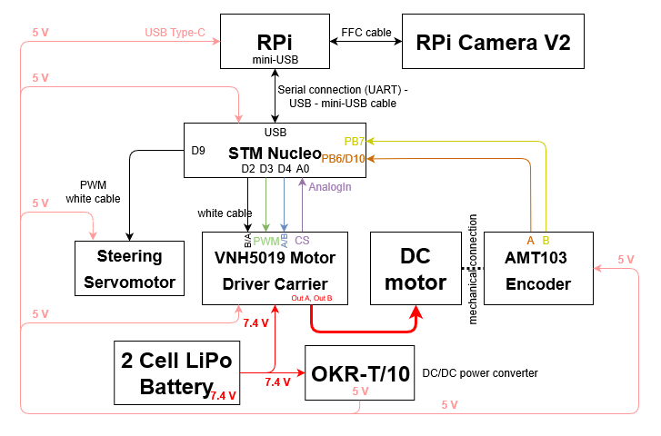

Connection diagram and components
=================================

In this section the components and the connections are listed. 
In the picture below you can see a simple connections diagram of the components. 
The GPIO lines are marked on each components.

NucleoF401RE
------------
.. image:: images/NucleoF401RE.jpg
   :align: center
   :scale: 75%

It's a micro-controller low level control. Here are some links: 
    - `Official site of NucleoF401RE`_ 
    - `Technical Documentation of STM32F401`_

.. _`Official site of NucleoF401RE`: https://www.st.com/en/evaluation-tools/nucleo-f401re.html
.. _`Technical Documentation of STM32F401`: ../../source/documents/STM32F401.pdf

Raspberry Pi 4 Mobel b
-----------------------

.. image:: images/RaspberryPi4.jpg
   :align: center
   :scale: 40%

It's a single board computer for high level control and features. The given version has 4GB RAM memory. Here are some links:
    - `Official site of Raspberry Pi 4`_
    - `Documentation of Raspberry Pi`_
    - `Other links`_

.. _`Official site of Raspberry Pi 4`: https://www.raspberrypi.org/products/raspberry-pi-4-model-b
.. _`Documentation of Raspberry Pi`: https://www.raspberrypi.org/documentation
.. _`Other links`: INVALID

VNH5012 H-bridge Motor Driver
-----------------------------

.. image:: images/VNH5019.jpg
   :align: center
   :scale: 50%

It's H-bridge for dc motor. Here are the links:
    - `Official site of VNH5019`_ 
    - `Technical Documentation of VNH5019`_

.. _`Official site of VNH5019`: https://www.pololu.com/product/1451
.. _`Technical Documentation of VNH5019`: ../../source/documents/vnh5019.pdf

AMT103 Encoder
--------------

.. image:: images/CUIAMT103.png
   :align: center
   :scale: 75%

It's a high accuracy incremental encoder. Here are some links:
    - `Official site of AMT103`_ 
    - `Technical Documentation of AMT103`_

    
.. _`Official site of AMT103`: https://www.cuidevices.com/product/motion/rotary-encoders/incremental/modular/amt10-series
.. _`Technical Documentation of AMT103`: ../../source/documents/amt10.pdf

DC/DC Converters
----------------

.. image:: images/DCDCConv.jpg
   :align: center
   :scale: 100%

It's a OKR-T/10-W12-C non-Isolated dc/dc converter to generate a 5V for supplying the components. Here are some links:
    - `Official site of converter`_
    - `Technical documentation (OKR-T/10-W12-C)`_

.. _`Official site of converter`: https://power.murata.com/okr-t-10-w12-c.html
.. _`Technical documentation (OKR-T/10-W12-C)`: ../../source/documents/DCConverter.pdf

Servo motor
------------

.. image:: images/Servo.jpg
   :align: center
   :scale: 50%

It's a Reely RS610WP Servo Motor. Links:
    - `Technical documentation (RS610WP)`_

.. _`Technical documentation (RS610WP)`: ../../source/documents/Servo.pdf

Battery
-------

.. image:: images/battery.jpg
   :align: center
   :scale: 100%

It's a Topfuel Lipo Batt. 20C-ECO-X with capacity 5000MAH and two cells. Links: 
    - `Usage Manual`_

.. _`Usage Manual`: ../../source/documents/ManualTopFuelLiPo.pdf

