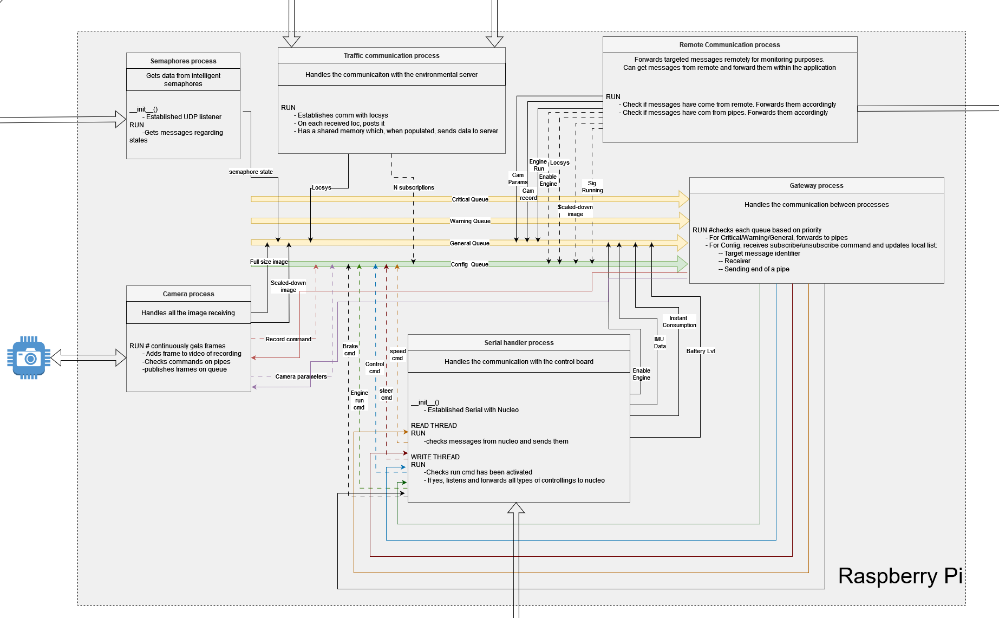
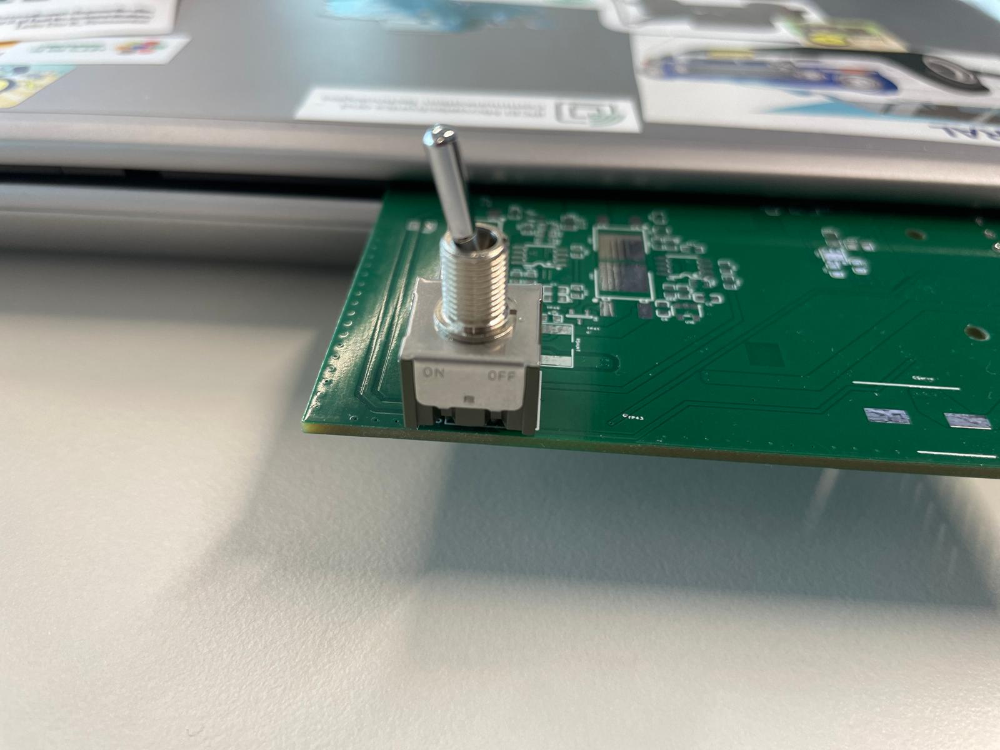

Brain project
=============

.. toctree::
   :maxdepth: 1
   :hidden:

   brain/setup

* :doc:`Python Multi Processing <brain/setup>`

  - Describing how to fresh-start with the project

As substitutes for this Brain project are the Startup_c and Brain_ROS. Though none of them are maintained, so if you chose to develop on each of them, you will 
have to adapt it based on the information you find here. 

This documentation describes the given brain project, which runs on the raspberry pi. It eases the 
process of starting up your vehicle by displaying some basic functionalities and describes 
how to use the given APIs to interact with the V2X systems. The following things are implemented
in the project (be advised that everything can be tunned to your project needs!):

    - Simple service-like architecture based on parallel processes, each with different running threads. 
    - Gateway that handles all the sent messages and forwards them to the subscribers (to enable easy testing and developing).
    - A class that describes all the messages, who's their owner and what their type is.
    - A camera driver-like process that can also modify in real time some of the camera parameters (like ISO and aperture), send multiple images with different settings (like resolution) and enables easy camera recording functionality.
    - A serial communication driver-like process, that communicates with the Nucleo board, it read messages form the nucleo on one thread (like battery info) and sends messages to it from another (like speed command).
    - An asyncronous server-like process that communicates with the Demo project from the Computer. It acts as middle-ground between the car and the demo, gets movement commands from the PC to the nucleo and forwards data info the other way around, plus getting data from the v2x APIs.
    - An asyncronous server-like process that communicates with the Dashboard project from the Computer. It acts as middle-ground between the car and the Dashboard projects, sending monitoring data to it.
    - API that gathers data sent via UDP on the network (assync data, from cars and from semaphores)
    - API that communicates with the TrafficCommunication server. Gets location data from the localization device and sends traffic info to the server.

*The following diagram shows the connections between the different processes and 
the Gateway. All the messages on the arrows can be prioritized as you see fit (General, Warning or Critical).*

++++++++++++++++++++++++
The starting point, Main
++++++++++++++++++++++++

The processes project consist of multiple processes that run concurrently and can be activated or deactivated
using certain **flags** present in the Main Script.

This is the script that initiates all the processes, including the most important one - the GateWay. 
The message queues are initialized as well and they are listed based on priority (which is not handled, just given out as a hint)

  #. Critical
  #. Warning
  #. General   
  #. Config

As mentioned, the queues can be used for prioritization of the messages. Critical, messages that are crucial to the functionality; 
Warning, something that requires attention; general, for all the information; config, for subscribing/unsubscribing to 
certain messages.

The GateWay process is started nonetheless, but all the other processes have **flags** assigned to them. 

*Camera* - enables the Camera process

*PCCommDemo* - it enables the PC Communication with the Demo app

*PCCommDasboard* - it enables the PC Communication with the Dashboard app, 

*SemsAndCars* - enables the Cars and Semaphores process

*Traffic* - enables the Traffic Communication process

*SerialHandler* - enables the Serial Handler process

+++++++++++
The Gateway
+++++++++++
The GateWay is responsible with checking continuously the messages on all the different queues.

To subscribe to a certain message type, a specific message must be sent on the config queue, which
subscribes a Pipe to a specific message. From now on, each message of that type arrives, the gateway 
will forward it to the registered pipe. 

The un-subscribing to specific messages can be done the same way as the subscribing.

On the checking of the queues prioritization can be given to the messages, such as discarding general ones if a critical 
messages has arrived.

++++++++++++++++++
The Camera Process
++++++++++++++++++
The Camera Process takes on the crucial role of interacting with the 
car's camera, which is the may sensor of the car.
This process has a thread that captures real-time images of the car's surroundings
on two different channels (big and small resolution) and sends them on the queue. 

Besides, the thread is also subscribed to the camera-config message, where other parties can 
send messages to modify some parameters of the camera. One other message where the thread is 
subscribed, is the record message, where start and stop recording commands can be sent. 

++++++++++++++++++++++
PC Communication Demo
++++++++++++++++++++++
The PC Communication Process 
acts as the bridge between our car and the Demo script on the Computer. Subscribes to all the 
main messages in the car and sends the data to the Demo app, from whom it receives commands 
such as speed and steering, and sends them on the queue, where the serialThread is subscribed 
and sends the commands to the Nucleo.

This process enables remote controlling and data exchange. 
Think of it as the car's messenger, relaying important information to 
and from the virtual realm.

++++++++++++++++++++++++++
PC Communication Dashboard
++++++++++++++++++++++++++
Very similar to the Demo communication process, the main difference being that it should be 
running when the car is (more or less) autonomous. It should serve as middle-ground for sending
monitoring data of the car to the Computer, enabling the team to check in real time all the systems 
of the car, such as flags pop-ups when certain obstacles are encountered, error to middle lane, 
steering angle of the car, speed, battery data, etc...

+++++++++++++++++++++++++++++++
The Cars and Semaphores Process
+++++++++++++++++++++++++++++++
The Cars and Semaphores Process 
is like a master conductor overseeing 
the symphony of vehicles and traffic lights signals on the road. 
This process listens for data about the positions 
of cars on the track and the status of traffic lights, sharing them with the interested parties.

It can be user as validation of certain obstacles, states or expectations. 

+++++++++++++++++++++++++++++++++
The Traffic Communication Process
+++++++++++++++++++++++++++++++++
The Traffic Process does some nesting activities. Firstly, it looks for the server on the network.
Once the server has been found, it validates it with an exchange of cryptographic data. Once the 
server has been validated, it requires the IP of the Localization device mounted on the car, from 
which it will listen from now on for all the localization data, forward it to the interested parties.

One other crucial thing is, it listens for data from the car, and sends traffic information to the 
server, helping it design a real-time map situation of the traffic.

++++++++++++++++++++++++++
The Serial Handler Process
++++++++++++++++++++++++++
Imagine the Serial Handler Process as the smooth-talking communicator 
of our software ecosystem. 
This process establishes and maintains a two-way conversation 
with the STM32 microcontroller embedded in our vehicle. 
It sends commands to control the car's 
various functions, such as: speed set, steering angle set, enable battery data reading, enable IMU data
reading... On the other thread instead, it receives information, such as "acknowledge" of the sent command 
(such as "speed has been set") or sensor data (such as "Rotation is...). 

++++++
To Run
++++++

1. Software part
  
Simply run the main.py in on the car (should automatically start with the given image).

To tune your connection, especially for when you will be present at the challenge, we suggest 
to change the connection password under https://github.com/ECC-BFMC/Brain/blob/master/src/utils/PCcommunicationDemo/threads/connection.py, line 61

2. Hardware part

- Check the battery connection with the powerboard.
- Turn on the power supply by presing the button.

- Press the engine button. It will make a long sound and after a pause another short sound. 
  If the process was carried out successfully, it will have a constant red color. If it failed, you will blink in red. In this case, you will have to press and hold the button until the color disappears and you have to restart
  the process.
  
.. image:: ../images/brain/EngineButtonOFF.jpg
  :align: center
  :width: 80%

.. image:: ../images/brain/EngineButtonON.jpg
   :align: center
   :width: 80%
