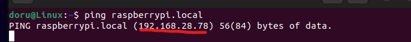

Project Setup
=============

Download Raspberry Pi Imager
-----------------------------
You can download the Raspberry Pi Imager from the official website: https://www.raspberrypi.com/software

Choose the Raspberry Pi OS
---------------------------
When configuring the Raspberry Pi Imager, select "Raspberry Pi OS Lite" as your operating system (OS) of choice.

Set Up Your Raspberry Pi
-------------------------
- Configure your desired username and password.
- Set up your Wi-Fi network settings.
- Enable SSH connection for remote access.

.. image:: ../../images/brain/raspberrySettings.png
    :align: center
    :width: 80%

Write the OS Image
-------------------
Use Raspberry Pi Imager to write the selected OS image to your SD card.

Insert SD Card and Power Up Raspberry Pi
-----------------------------------------
Place the SD card into your Raspberry Pi and power it up.

Find the IP Address of Your Raspberry Pi
-----------------------------------------
Locate the IP address of your Raspberry Pi on your local network.

Connect to the Raspberry Pi via ssh
------------------------------------
Use SSH to establish a connection to your Raspberry Pi:

.. code-block:: bash

   ssh <username>@<Raspberry_Pi_IP_Address>
    

Clone the Brain Repository
---------------------------
Clone the Brain repository from GitHub to your desired location (e.g., under "Documents"):

.. code-block:: bash

   git clone https://github.com/ECC-BFMC/Brain

Update and Install Necessary Software
--------------------------------------
Run the following commands to update and upgrade your Raspberry Pi's software and install required packages:

.. code-block:: bash
   
   sudo apt-get update
   sudo apt-get upgrade
   sudo apt-get install python3-opencv
   pip3 install -r requirements.txt

Enjoy Your Raspberry Pi Brain Setup
------------------------------------
Your Raspberry Pi is now set up with the Brain repository, and all the necessary software is installed. Enjoy exploring and experimenting with your Raspberry Pi Brain project!
