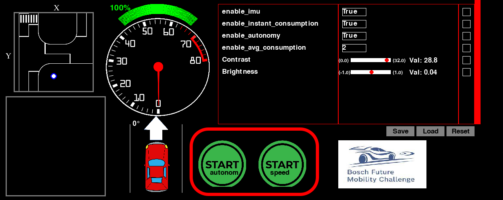
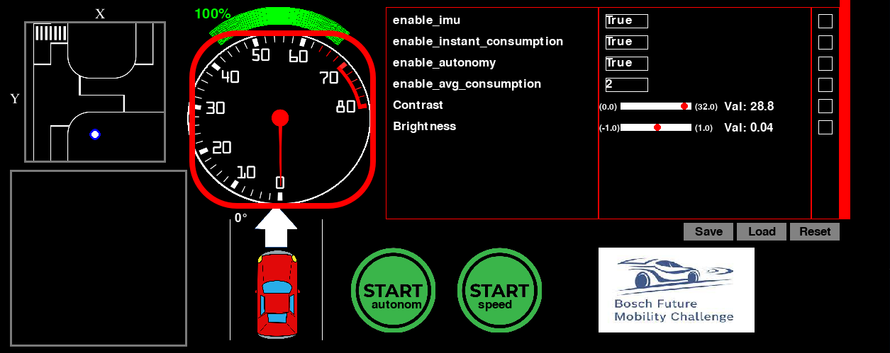
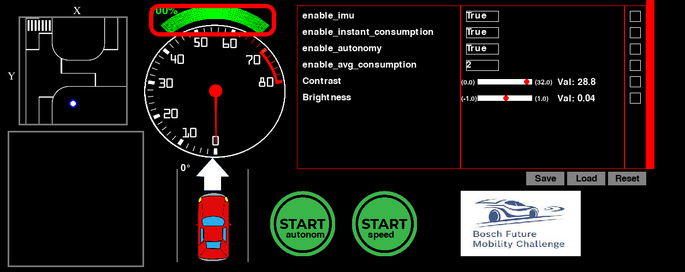
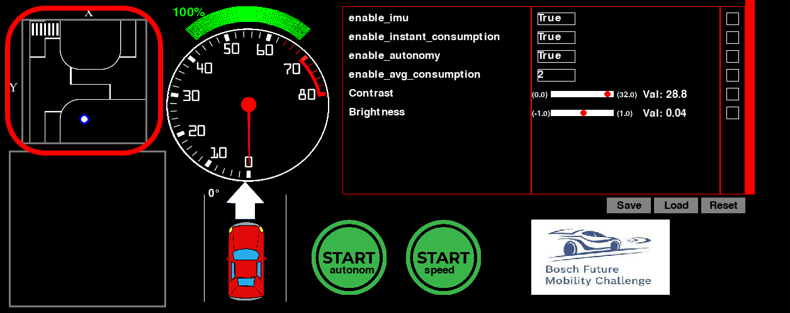
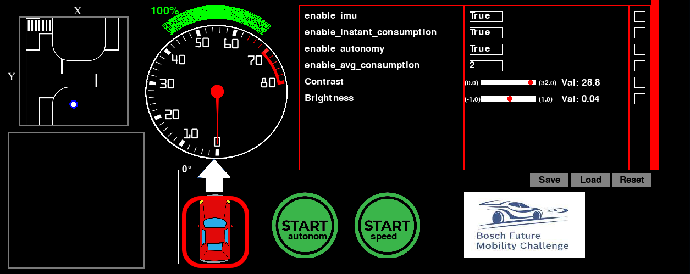
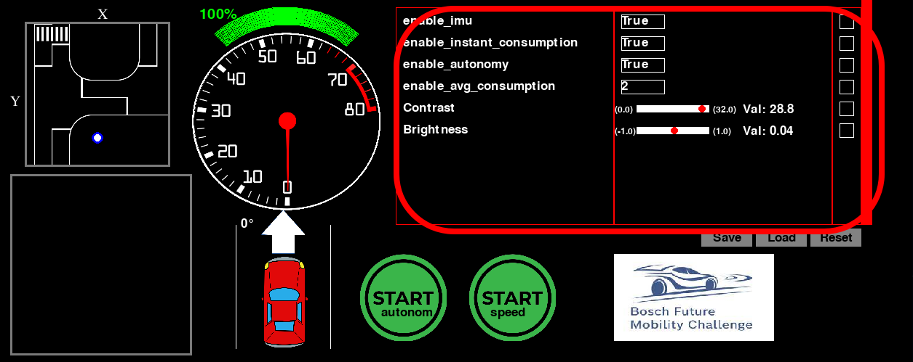
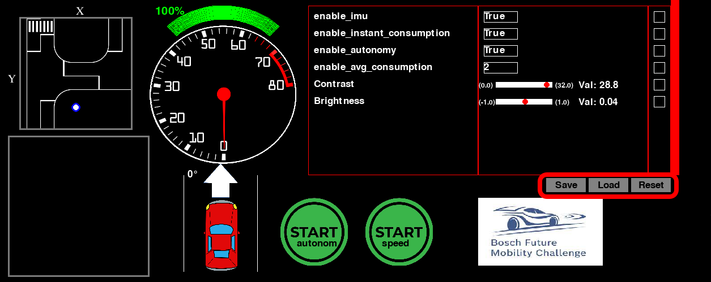

Dashboard
=========
.. image:: ../../images/computer/dashboard.png
    :align: center
    :width: 80%

Starting the Dashboard
-----------------------
To start the Dashboard interface:

- you will have to open one terminal.
- navigate to Computer/Dashboard
- type the code bellow to start the interface:
  
.. code-block:: bash

    python3 Dashboard.py

Elements of the interface 
--------------------------
The interface contains the next elements:

- Camera frame
- Buttons for starting the speed challenge and for starting the normal challenge
- Table of alerts
- Speedometer
- Battery level graphical information 
- Map
- Line alignment graphical information
- Buttons for load, save and reset for table
- Steering angle  graphical and numeric information
- Control Table

Camera frame
-------------

In the image with the BFMC logo you will see the image given by the camera.

The image is in an RGB format.

You will be able to see the image only if the connection between interface and Raspberry PI is made, and the Camera flag is set on True and DemoConnection flag is set on False.

Starting buttons
-----------------

The main purpose of these buttons is to start the car for the two challenges.

If one of the buttons is pressed the other one will be disable.

To enable the other button you will have to stop the pushed button.

These two buttons work on the same set of data, but you will have to change the output of them. For example, you will have to turn down the semaphore recognition for the speed probe.

Table of alerts
----------------

This table will show the alerts for 3 seconds. They will fade away. 

There are 21 different alerts. Each one of them is triggered by the actions that Brain component is sending to the Dashboard.

If you want to add/modify this alerts, all you need to do is to add a new photo in images folder in lights and to add the value in the Alerts.json from setup folder.

Speedometer
------------

The Speedometer will show you the speed in cm/seconds.

The speed is received from Raspberry PI from IMU hardware component.

It works the same as a real car speedometer.

Battery level graphical information 
------------------------------------

Right above the speedometer we have our battery level graphical information.

It will show you the battery percentage, and it will change color depending on how much of the battery remains.

Map
----

What you can see by starting the interface is a small part of the entire map. The window that you can see will move when you are moving, so we don`t need to show the entire map, only a small portion of it.

You can simulate the movement of the point representing your car by starting the interface and the traffic control server.

Line alignment graphical information
-------------------------------------

In the middle of the interface you can find a car and two horizontal lines on the sides of it. The car will move according to the real 1/10 car. It will change its position between the two lanes as the real car will be placed between the two lanes of the track.

Steering angle  graphical and numeric information
--------------------------------------------------

Above the car in the middle of the interface you will see an arrow which show you the steering angle of the car in real time. It also writes the angle in degrees right besides the arrow.

Control Table
--------------

The control table is the most complex strucutre in the interface. It will receive three type of information:

- static values from Raspberry PI
- adjustable values from a predetermined rage(sliders)
- changeable values from a list of predetermined values(dropdown)

If the values will be more than the table can show it will start to increase its wheel slider, and it will show only a spectrum of nine values at a time.

The last two types of value will have a checkbox( the checkbox that we talk about at the load button).

If the value is changed from the value that it is stored in the json, it will be marked with a red square.

Buttons for load, save and reset for table
-------------------------------------------

On the bottom left part of the control table you will find the three buttons.

Save button will save the current values from the table in the json file.

Reset button will change the current values from the table with the values from the json.

Load button will send the current values from the control table to Raspberry PI but only if their boxes are checked.
