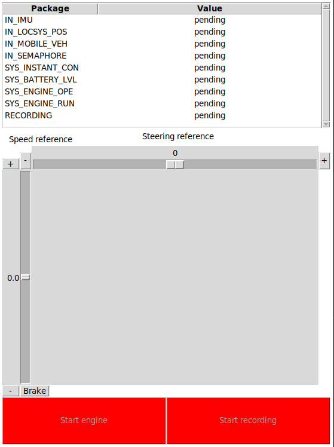
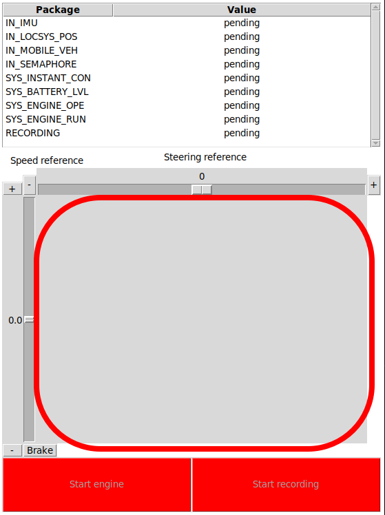
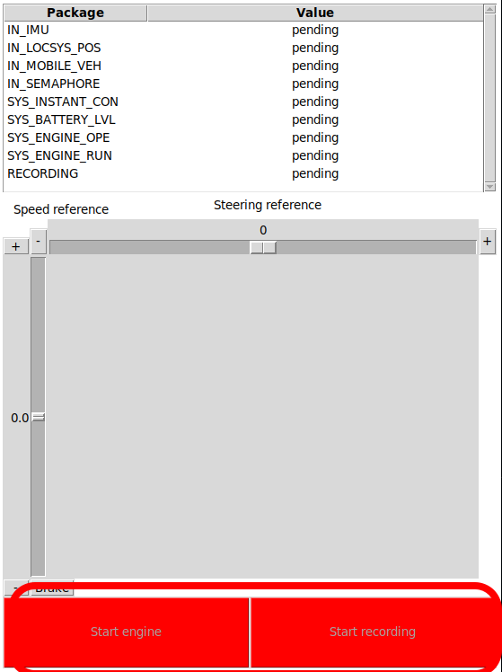
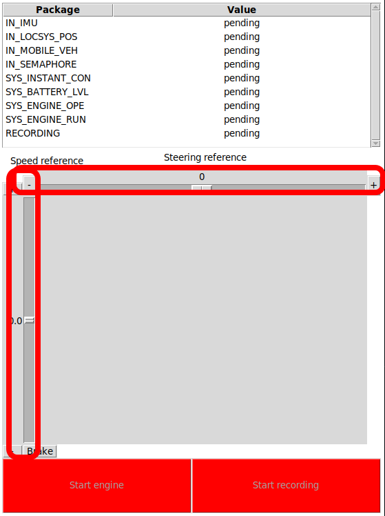
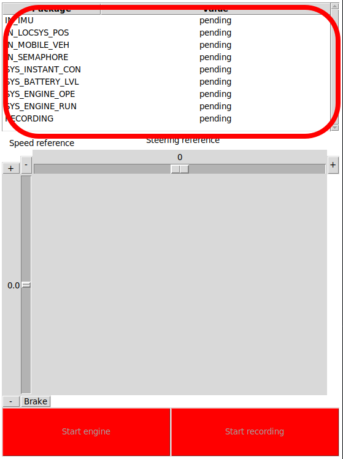

Demo
====

Starting the Demo
------------------
To start the Demo interface:

- you will have to open one terminal.
- navigate to Computer/Demo
- type the code below to start the interface:
  
.. code-block:: bash

    python3 Demo.py

Elements of the interface 
--------------------------
The interface contains the next elements:

- Camera frame
- Buttons for recording and starting the engine
- Sliders for angle and speed adjustment
- Table of flags/data

Camera frame
-------------

In the gray square represented in the picture you will see the image given by the camera.

The image is in an YUV400 format.

You will be able to see the image only if the connection between interface and raspberryPI is made and the Camera flag and DemoConnection flag are set on True.

Buttons for recording and starting the engine
----------------------------------------------

This interface has two buttons Start Engine and Start Recording.

At the beginning the buttons are not enabled. 

The recording button will be enabled after we received the first frame from the camera. 

The engine button will be enabled after we received a signal from raspberryPI that will signal us that the car is ready to be used.

As their name says, the recording button will start the record on the raspberryPI, it will save the video in Brain folder and the start engine will enable the serial connection between RaspberryPI and NUCLEO(it will allow you to set speed/steering angle)

Sliders for angle and speed adjustment
---------------------------------------

There are two slides one vertical slider and one horizontal slider.

The vertical slider will adjust the speed of the car. The horizontal one will adjust the steering angle of the car.

There are buttons for incrementing and decrementing of both sliders value. They are represented as "+" and "-". You can find them at the both ends of the sliders.

Each modification on the sliders is sent to Raspberry Pi as a dictionary which contains the action and the value to be changed.

Table of flags/data
--------------------

This table will have nine rows that will always be showed. If the interface receive more information to be showed in the table it will add a new row.

There are two types of rows: information row and flag row.

A flag row will have two values True/False. As an example we will have the "RECORDING" row, at the beginning it will be set on False but after pushing the button start Record it will be set on True.

An information row will receive different values. As an example we have "IM_LOCSYS_POS" row, it will show us what is the car position on the map. It will change its value every time new information about it will be received.