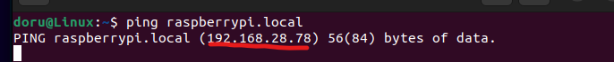
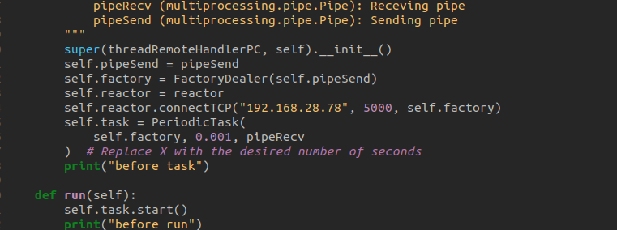
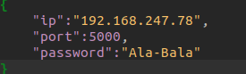

Setup 
======

Clone the Computer Repository
-----------------------------
Clone the Computer repository from GitHub to your desired location (e.g., under "Documents"):

.. code-block:: bash
    
    git clone https://github.com/ECC-BFMC/Computer

Get Raspberry PI`s IP address.
------------------------------
You will need Raspberry PI`s IP address.

- Open the terminal.
- Enter the following command:

.. code-block:: bash

    ping raspberrypi.local

- The IP address will be displayed just below the command.

IP address
-----------
    
After you found your IP address you will have to write it in two places to be able to connect to Demo and Dashboard.

- Go to Demo/threadRemotehandler.py in the __init__ function of the threadRemoteHandlerPC class;
- Change the current IP address with the Raspberry PI`s IP;
- From now you will be able to connect the Raspberry PI and Demo interface;

- Go to Dashboard/setup/PairingData.json;
- Change the current IP address with the Raspberry PI`s IP.

Libs
-----

Run the following commands to update and upgrade your software and install required packages:

.. code-block:: bash

    sudo apt-get update
    sudo apt-get upgrade
    sudo apt-get install python3-opencv
    pip3 install -r requirements.txt

Enjoy using the Computer repository
------------------------------------
All is now set up. All the necessary software is installed. Enjoy tracking your progress with the Dashboard interface, use the Demo interface as way to an example and use the servers to improve your code.