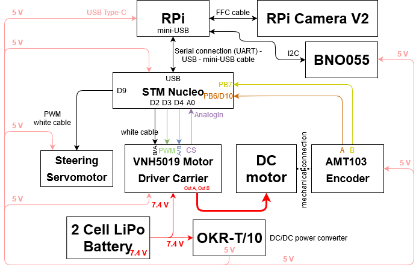

Connection diagram and components
=================================

.. toctree::
   :maxdepth: 1
   :hidden:

   connectiondiagram/components
   connectiondiagram/printedcomponents
   connectiondiagram/powerboard

* :doc:`Components <connectiondiagram/components>`

  - The list of all the bought components in the car.

* :doc:`Printed Components <connectiondiagram/printedcomponents>`

  - A list of all the 3d printed components in the car.
  
* :doc:`Powerboard <connectiondiagram/powerboard>`

  - Info about the power distribution board.

In this schematics you can see the connections diagram of all the HW components in the car. The GPIO lines are marked on each components.

