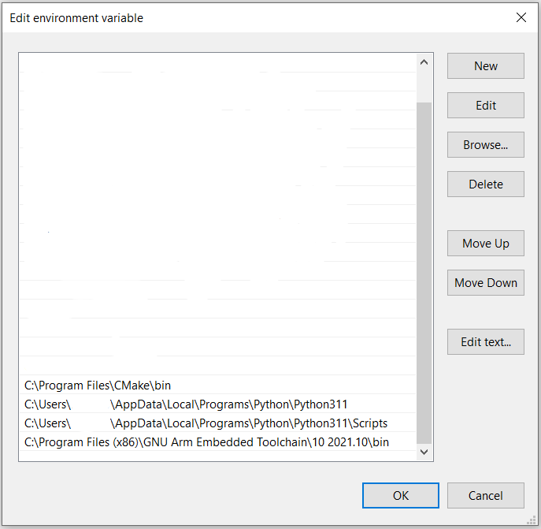
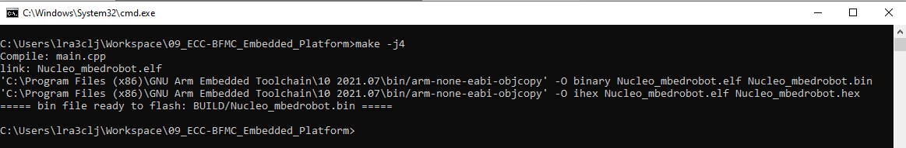

Embedded platform
=================

.. toctree::
   :maxdepth: 1
   :hidden:

   embeddedplatform/flowDiagram

The embedded platform refers to the code that is written on the Nucleo board, more precisely the low level application, which runs on the 
micro-controller. It aims to provide an interface between high level processing and low level motors control and sensor reading. The code 
uses mbed os version=5.6. 

The project is structured on 4 layers: Brain, Drivers, Periodics and Utils. 
    - The 'Brain' folder contains the state machine of the Nucleo. More controlling methods can be handled here. 
    - The 'Drivers' folder contains the code to interact directly with the steering motor, speeding motor and with the IMU.
    - The 'Periodics' folder contains the tasks that are executed periodically by the Nucleo board, based on interruptions, such as writing the sensors values on the serial Tx or checking the serial Rx, then applying the necessary callbacks (used for movements control).
    - The 'Utils' folder contains various working tools, such as the serial communication message construction/deconstruction, callbacks on the necessary functions, tasks execution and queues.

The low level control application, which runs on the Nucleo-F401RE, is implemented in C/C++ language. Down below you can find some tips on how
to further develop on top of the project

Building
--------

Preliminary Setup
~~~~~~~~~~~~~~~~~

Before you initiate the building process, ensure to correctly set up your environment. Below, you will find a step-by-step guide to setting up the necessary tools and environments:

1. **Python Installation**:
   
   Install a Python version that is 3.6 or newer. You can download it from the `official Python website <https://www.python.org/downloads/>`_.

2. **CMake Installation**:

   Install CMake to manage the build process of your software. `Download it here <https://cmake.org/download/>`_.

3. **Ninja Installation**:

   Install Ninja using the following pip command:

   .. code-block:: bash

      pip install ninja
      python -m pip install ninja

   If you prefer to install it through a different method, you can find the installation commands `on this GitHub page <https://github.com/ninja-build/ninja/wiki/Pre-built-Ninja-packages>`_.

4. **Mbed-tools Installation**:

   Install mbed-tools using the pip command as follows:

   .. code-block:: bash

      pip install mbed-tools
      python -m pip install mbed-tools

5. **Cross-Compiler Installation**:

   Install a cross-compiler to build your project for the Nucleo-F401RE. `Find the suitable one here <https://developer.arm.com/downloads/-/gnu-rm>`_.

Windows Setup
~~~~~~~~~~~~~

After installing all the preliminary components, you need to check the environment variables to ensure they are set up correctly. Verify if you can find them as shown in the image below:

If they are not present, you can copy the following paths to set up your environment variables correctly:

- ``C:\Program Files\CMake\bin``
- ``C:\Users\fill_with_your_user\AppData\Local\Programs\Python\Python311``
- ``C:\Users\fill_with_your_user\AppData\Local\Programs\Python\Python311\Scripts``
- ``C:\Program Files (x86)\GNU Arm Embedded Toolchain\10 2021.10\bin``

Make sure to replace ``fill_with_your_user`` with your actual username.

**Setting Up the MBED OS Version**

To set up the necessary MBED OS version, first navigate to the project path in your command prompt or terminal. Once there, fetch the mbed-os from the actual commit specified in the 'mbed-os.lib' file using the "deploy" command. If at any point you wish to use a different MBED OS version, simply modify the line with the desired commit.

.. code-block:: bash

    cd path/to/your/project
    mbed-tools deploy

**Actual Building**

As for the MBED CLI 2 documentaiton, mbed-tools command is used for the building, the outcome being as follows (if no modification is done):

This will update the cmake_build directory in your project

Flashing 
--------

The Nucleo board has two main parts: the programmer/debugger and the micro-controller. The programmer has the mini-usb connector while the 
micro-controller part is the one with the connectors. The micro-controller can be powered by external source (USB) or by a power supply (wires), 
while the debugger can be powered on only by the USB. The jumper JP5 near the reset button choses the power source for the micro-controller 
(E5V - via external or U5V - via usb). 

Connect the programmer to your computer (make sure the programmer and make sure the micro-controller are both powered on), and you will see a 
new Path in your file explorer, that being something like: D:Nucleo_F401RE. Simply copy the binary file from cmake_build\NUCLEO_F401RE\develop\GCC_ARM 
directory (mbed_robot_car.bin) on this path. 

Another way to flashing your code on the car is to add a "-f" flag to the compile command (check the mbed cli 2 documentation)

During the flashing, the led of the programmer will flash alternatively with Green&Red light, staying still on red once it's finished. At the end, the 
Nucleo will reboot and the code will be running on the board.

New component
-------------

When you want to implement some new feature, it's recommended to keep clean the project structure. With this in mind, you will notice that the "include"
and the "source" directory are following the same structure, ".hpp" files being under the the "include" and ".cpp" files under source. 

Usually, when adding new components, they should be added to the "CMakeList.txt", but in this case, all the subdirectories are automatically included, as
long as they are within the same structure. If you wish to add a new layer, modifications must be done to the file, adding the new layer.

**Utilizing the newComponent.py Script**

To facilitate the addition of new components to the project, utilize the newComponent.py script. This script automates the process of creating the necessary files and directories for a new component, adhering to the existing structure of the project. Here is how you can use the script:

1. Navigate to the directory where the newComponent.py script is located (should be inside the project directory).
2. Run the script in a terminal or an IDE.
3. When prompted, input the category of the component (valid options are "brain," "driver," "periodics," or "utils").
4. Next, input the name of the new component.

Debugging
---------

You can easily try do debug your Nucleo code by communicating with it via serial. In order to do so, you can install putty and connect the Nucleo 
directly to the PC. Check the COM of the device and then open putty, by setting it as follows:

    - Connection type - Serial
    - Speed - 19200
    - Serial line - COMxx
    - Terminal == local-echo - Force on
    - Terminal == Local line editing - Force on

Go to session and then press Open.

Now you can reset the Nucleo (black button) and check in the terminal for "I'm alive" message. If the message comes, the Nucleo code is starting 
correctly and now you can try to communicate with it. After each message, you have to press Ctrl+M, then Ctrl+J. 

**The sent messages structure is as follows:**

``#1:speed;;`` 
    | It is setting the navigation speed. Where speed must be between -5.0 and 5.0, and is measured in meters/second, while the minus indicates backward movement.

``#2:angle;;`` 
    | It is setting the steering angle. Where angle must be between -23.0 and 23.0, and is measured in degrees of the servo, while the minus indicates left turning.

``#3:angle;;`` 
    | It is setting the brake. Where angle must be between -23.0 and 23.0, and is measured in degrees of the servo, while the minus indicates left turning.

``#4:1;;`` 
    | It is starting the calibration method for the brushless motor, indications will be then returned on the screen.

**The received messages structure is as follows:**

``@1:ack;;``  
    | acknowledgment message that the speed has been set.

``@2:ack;;``  
    | acknowledgment message that the steering value has been set.

``@3:ack;;``  
    | acknowledgment message that the brake state has been set.

``@4:action;;``  
    | indications on how to proceed with the calibration.

``@4:ack;;``  
    | acknowledgment message that the calibration has been done.

``@5:value;;``  
    | value of the battery voltage level.

``@6:value;;``  
    | value of the instant consumption (Watts).

``@7:roll;pitch;yaw;accelx;accely;accelz;;``  
    | values of the IMU measurements

Notes
------

The script for creating a new component (newComponent.py) and for flashing the micro-controller weren't projected to linux usage, so we cannot guarantee the 
correct working.
* :doc:`Flow diagram <embeddedplatform/flowDiagram>` 

