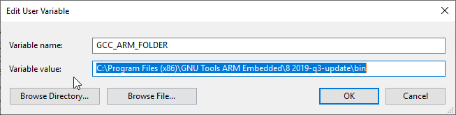
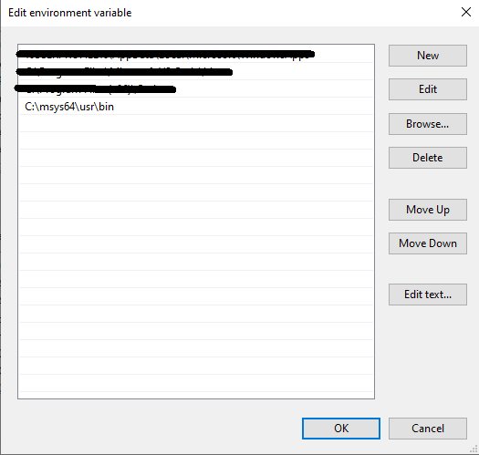

Embedded platform
=================

The embedded platform refers to the code that is written on the Nucleo board, more precisely the low level application, which runs on the 
micro-controller. It aims to provide an interface between high level processing and low level motors control and sensor reading. The code 
uses mbed os version=5.6. 

The project is structured on 4 layers: Brain, Drivers, Periodics and Utils. 
    - The 'Brain' folder contains the state machine of the Nucleo. More controlling methods can be handled here. 
    - The 'Drivers' folder contains the code to interact directly with the steering motor, speeding motor and with the IMU.
    - The 'Periodics' folder contains the tasks that are executed periodically by the Nucleo board, based on interruptions, such as writing the sensors values on the serial Tx or checking the serial Rx, then applying the necessary callbacks (used for movements control).
    - The 'Utils' folder contains various working tools, such as the serial communication message construction/deconstruction, callbacks on the necessary functions, tasks execution and queues.

The low level control application, which runs on the Nucleo-F401RE, is implemented in C/C++ language. Down below you can find some tips on how
to further develop on top of the project

Building 
--------

After the modification or adition of any components, you have to rebuild the application. In order to do so, aditional software is required. 

**Windows setup**

Firstly you need a cross-compiler, you can find it on the official site of Arm Developer. Here is a `link <https://developer.arm.com/tools-and-software/open-source-software/developer-tools/gnu-toolchain/gnu-rm/downloads>`_ .
Install the Gnu Embedded Toolchain for Arm, then you need to add a new environment variable with 'GCC_ARM_FOLDER' name, which value is the 
compiler folder (example in the following picture). 

Another application necessary for building is MSYS2. Add then the location of installation folder in the 'Path' environment variable. 

**Linux setup**

The GNU Core utilities are already installed on linux, so only the setup for Gnu Embedded Toolchain for Arm is required, which means you will have to download
a linux version from this `link <https://developer.arm.com/tools-and-software/open-source-software/developer-tools/gnu-toolchain/gnu-rm/downloads>`_  
and decompress it on your pc. After decompressing, you need to set the 'GCC_ARM_FOLDER' environment variable with the location where you decompressed
the cross-compiler. Therefore the 'make' utility knows the location of cross-compiler. To add the persistent environment variable you will need to 
introduce a code in terminal similar to the following:

.. code-block:: bash
    echo "export GCC_ARM_FOLDER=/home/user/Workspace/Crosscompilers/gcc-arm-none-eabi-8-2019-q3-update/bin" >> ~/.bashrc

``python newComponent.py --help``

The variable is accessible only for your user and you have to restart the terminal for it to be valid. 

**Actual Building**

If you set correctly the environment variable, then the 'make' command is recognized in command prompt (terminal). Just open it in the father 
directory and then execute it (using more threads would help speed up the proccess). 

.. image:: ../images/toolsfordev/make-ing.png
    :align: center
    :scale: 75%

This will update the BUILD directory in your project

Flashing 
--------

The nucleo board has two main parts: the programmer/debugger and the micro-controller. The programmer has the mini-usb connector while the 
micro-controller part is the one with the connectors. The micro-controller can be powered by external source (USB) or by a power supply (wires), 
while the debugger can be powered on only by the USB. The jumper JP5 near the reset button choses the power source for the micro-controller 
(E5V - via external or U5V - via usb). 

Connect the programmer to your computer ( make sure the programmer and make sure the micro-controller are both powered on)., and you will see a 
new Path in your file explorer, that being the Nucleo_F401RE. Simply copy the binary file from BUILD directory (Nucleo_mbedrobot.bin) on the 
path. Alternatively, run the 'flash_win.bat' script, present in the project directory (it does the same action). If you use the flash_win, check 
that the programmer mounted partition identification letter is the same one mentioned in script. If they don't match, you can update in the script 
with the right new one (like D:, F:, C:). 

After copying, the Nucleo will rebote and the code will be on the board.

New component
-------------

When you want to implement some new feature, it's recommended to keep clean the project structure. For this reason, you need to create the header 
files in the 'include' directory and the source file in the 'src' folder (following the same name and location). You can also do this by running 
the 'newComponent.py' script, which creates automatically the include file and the source file. There are some optional parameters: you can check 
them by using '-help' parameter. 

``python newComponent.py --help``

The script creates two includes files: 'test.hpp' and 'test.inl' in the 'include' folder and a source file ('test.cpp') in the 'src' folder. 

``python newComponent.py -c test``

If you want to compile these new components, then you must add them to the makefile like new objects, as in the picture below. We suggest to add
the files between lines 49 and 69.

.. image:: ../../images/toolsfordev/makefile_example.png
    :align: center
    :scale: 75%

Debugging
---------

You can easly try do debug your Nucleo code by communicating with it via serial. In order to do so, you can install putty and connect the nucleo 
directly to the PC. Check the COM of the device and then open putty, by setting it as follows:

    - Connection type - Serial
    - Speed - 19200
    - Serial line - COMxx
    - Terminal == local-echo - Force on
    - Terminal == Local line editing - Force on

Go to session and then press Open.

Now you can reset the Nucleo (black button) and check in the terminal for "I'm alive" message. If the message comes, the nucleo code is starting 
correctly and now you can try to communicate with it. After each message, you have to press Ctrl+M, then Ctrl+J. 

**The sent messages structure is as follows:**

``#1:speed;;`` 
It is setting the navigation speed. Where speed must be between -5.0 and 5.0, and is measured in meters/second, while the minus indicates backward movement.
``#2:angle;;`` 
It is setting the steering angle. Where angle must be between -23.0 and 23.0, and is measured in degrees of the servo, while the minus indicates left turning.
``#3:angle;;`` 
It is setting the brake. Where angle must be between -23.0 and 23.0, and is measured in degrees of the servo, while the minus indicates left turning.
``#4:1;;`` 
It is starting the calibration method for the brushless motor, indications will be then returned on the screen.

**The received messages structure is as follows:**

``@1:ack;;``  
acknowledgment message that the speed has been set.
``@2:ack;;``  
acknowledgment message that the steering value has been set.
``@3:ack;;``  
acknowledgment message that the brake state has been set.
``@4:action;;``  
indications on how to proceed with the calibration.
``@4:ack;;``  
acknowledgment message that the calibration has been done.
``@5:value;;``  
value of the battery voltage level.
``@6:value;;``  
value of the instant consumption (Watts).
``@7:roll;pitch;yaw;accelx;accely;accelz;;``  
values of the IMU measurements

Notes
------

The script for creating a new component (newComponent.py) and for flashing the micro-controller weren't projected to linux usage, so we cannot guarantee the 
correct working. 

