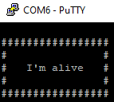

Debugging
=========

You can easily try do debug your Nucleo code by communicating with it via serial. In order to do so, you can install putty and connect the Nucleo 
directly to the PC. Check the COM of the device (in device manager) and then open putty, by setting it as follows:

    - Connection type - Serial
    - Speed - 19200
    - Serial line - COMxx
    - Terminal == local-echo - Force on
    - Terminal == Local line editing - Force on

Go to session and then press Open.

Once you started the putty, a sign that everything works is: == the `I'm alive` message, after that you can try to communicate with it. After each message sent, 
you have to press Ctrl+M, then Ctrl+J. 

The Nucleo has 3 power states: KL0, KL15 and KL30, all designed as a safety feature:
    - ``KL0`` Nothingis working. whatever command you send or ask from the Nucleo, will be discarted.
    - ``KL15`` Only the interaction with the sensors work, actions like: reading data from IMU, reading data regarding instant consumption, total voltage, autonomy...
    - ``KL30`` Enables also the control of the vehicle. Now, messages like: set speed, set seering angle, set movement duration will work.

The Nucleo has a PowerManager, used to protect your work and to increase your safety. Mainly, it does the following:
    - If the battery drops below 6.9 Volts, it sends via serial a warning about it, it does so every x seconds.
    - If the battery drops below 6.8 Volts, it sends via serial an error, and then the nucleo puts itself into sleep mode. 
    - To avoid building each time a battery is changed, it also can receive messages via serial about the capacity of the battery/s connected.

Nucleo expects via serial the following structure:

``#command:val1;val2;valx;;\r\n``

And, for each command that it receives, it sends back the following structure:

``@command;response1;response2;;\r\n``

Where, ``command`` can be any of the following, while ``valx`` and ``responsex``, can be configured separately. while ``;\r\n`` signals the end of the message.

==================  ==================  ==================  ==============================  ===========================
command             Description         value               Example request                 Example response      
==================  ==================  ==================  ==============================  ===========================
speed               Sets the target     signed float Speed  #speed:6.0;;\r\n                #speed:ack;;\r\n
                    speed of the        [cm/s] (4,50) /     

                    vehicle             (-50,-4)    

steer               Sets the target     signed float steer  #steer:18.0;;\r\n               #steer:ack;;\r\n
                    steering of the     [deg] (-23,+23)     

                    vehicle 

brake               Sets the vehicle    signed float steer  #steer:18.0;;\r\n               #brake:ack;;\r\n
                    in brake state      [deg] (-23,+23)     

                    but allows to set       
                    the steering    

vcd                 Sets the velocity   signed float Speed  #vcd:8.0;-13.0;12.1;\r\n        #vcd:ack;;\r\n
                    control duration    signed float Steer                                  

                    i.e. a specific     signed float time   
                    movement for a      [seconds] (0,n) 

                    period of time  

kl                  Sets the power      unsigned int state  #kl:15;;\r\n                    #kl:ack;;\r\n
                    state of the        [0,15,30] 
                    
                    nucleo

batteryCapacity     Sets the capacity   unsigned int        #batteryCapacity:12000;;\r\n    #batteryCapacity:ack;;\r\n
                    of the battery/s    mAh 

==================  ==================  ==================  ==============================  ===========================

**The sent messages structure is as follows:**

``#1:speed;;`` 
    | It is setting the navigation speed. Where speed must be between -50.0 and 50.0, and is measured in centimeters/second, while the minus indicates backward movement.

``#2:angle;;`` 
    | It is setting the steering angle. Where angle must be between -25.0 and 25.0, and is measured in degrees of the servo, while the minus indicates left turning.

``#3:angle;;`` 
    | It is setting the brake.

``#5:1;;`` 
    | It starts the task of sending the battery voltage periodically.

``#6:1;;`` 
    | It starts the task of periodically sending the battery's instant current consumption.

``#7:1;;`` 
    | It is starting the IMU measurements.

.. ``#8:point1.x,point1.y;..;pointN.x,pointN.y;;`` 
..     | It is taking the provided 2D points and used them as control points for a Bezier Curve. The car will then follow the resulting curve as its path.

``#9:speed,time,angle;;`` 
    | This sets the `speed` and the steering `angle` for a specified period of `time`.

**The received messages structure is as follows:**

``@1:ack;;``  
    | acknowledgment message that the speed has been set.

``@2:ack;;``  
    | acknowledgment message that the steering value has been set.

``@3:ack;;``  
    | acknowledgment message that the brake state has been set.

``@5:value;;``  
    | value of the battery voltage level.

``@6:value;;``  
    | value of the instant consumption (Amps).

``@7:roll;pitch;yaw;accelx;accely;accelz;;``  
    | values of the IMU measurements.

.. ``@8:ack;;``  
..     | acknowledgment message that the Bezier curve has been computed and the car can follow it.

``@9:ack;;``  
    | acknowledgment message indicating that the speed and steering angle have been set for the specified duration.
