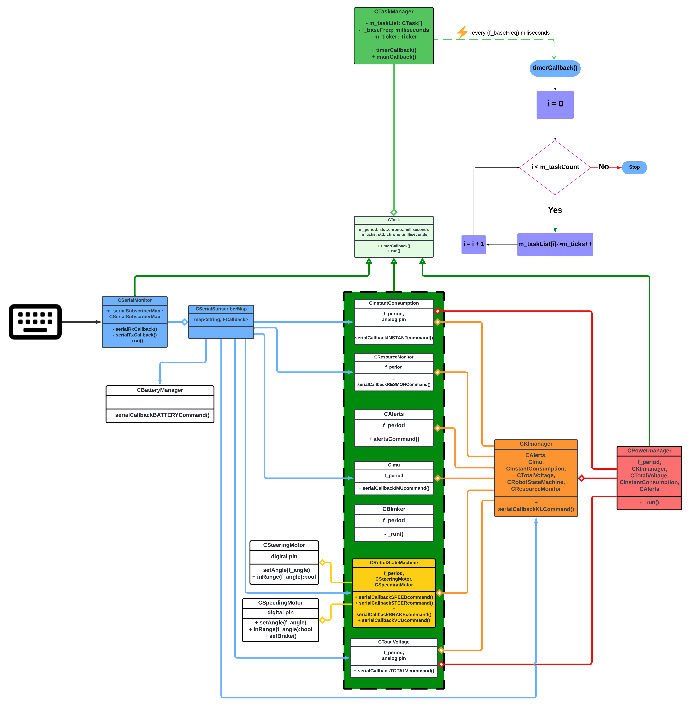

Main Flow
==============================

If the "I'm alive" message comes, the Nucleo code is starting correctly and now you can try to communicate with it. After each message, you have to press Ctrl+M, then Ctrl+J. 

**The sent messages structure is as follows:**

``#1:speed;;`` 
    | It is setting the navigation speed. Where speed must be between -5.0 and 5.0, and is measured in meters/second, while the minus indicates backward movement.

``#2:angle;;`` 
    | It is setting the steering angle. Where angle must be between -23.0 and 23.0, and is measured in degrees of the servo, while the minus indicates left turning.

``#3:angle;;`` 
    | It is setting the brake. Where angle must be between -23.0 and 23.0, and is measured in degrees of the servo, while the minus indicates left turning.

``#4:1;;`` 
    | It is starting the calibration method for the brushless motor, indications will be then returned on the screen.

**The received messages structure is as follows:**

``@1:ack;;``  
    | acknowledgment message that the speed has been set.

``@2:ack;;``  
    | acknowledgment message that the steering value has been set.

``@3:ack;;``  
    | acknowledgment message that the brake state has been set.

``@4:action;;``  
    | indications on how to proceed with the calibration.

``@4:ack;;``  
    | acknowledgment message that the calibration has been done.

``@5:value;;``  
    | value of the battery voltage level.

``@6:value;;``  
    | value of the instant consumption (Watts).

``@7:roll;pitch;yaw;accelx;accely;accelz;;``  
    | values of the IMU measurements

Overview
--------

The flow diagram depicted below outlines the functional operation and the structure of the embedded platform's software. This graphical representation facilitates a deeper understanding of how various components interact within the system.

Through the diagram, we aim to showcase the hierarchical nature of different software layers and how they contribute to the overarching functionality of the platform. It also illustrates the interaction between the main loop and the various subsystems.

