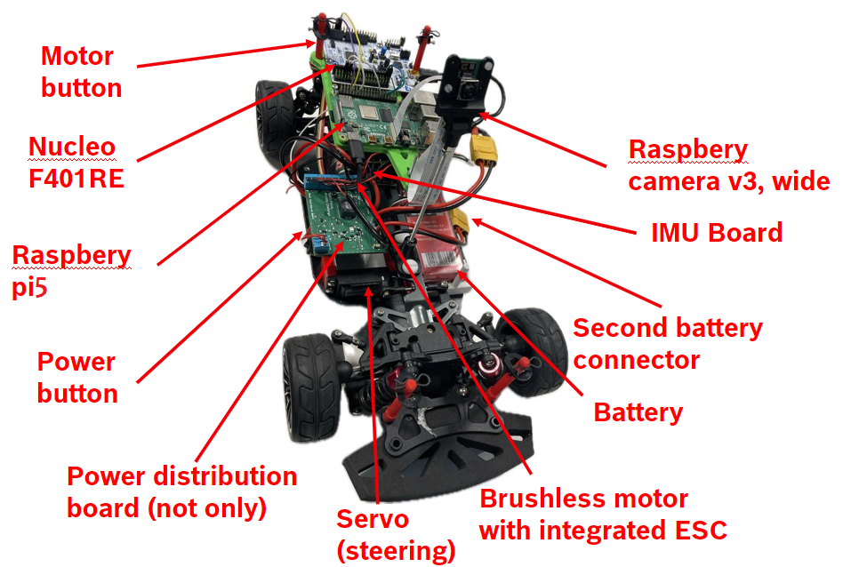
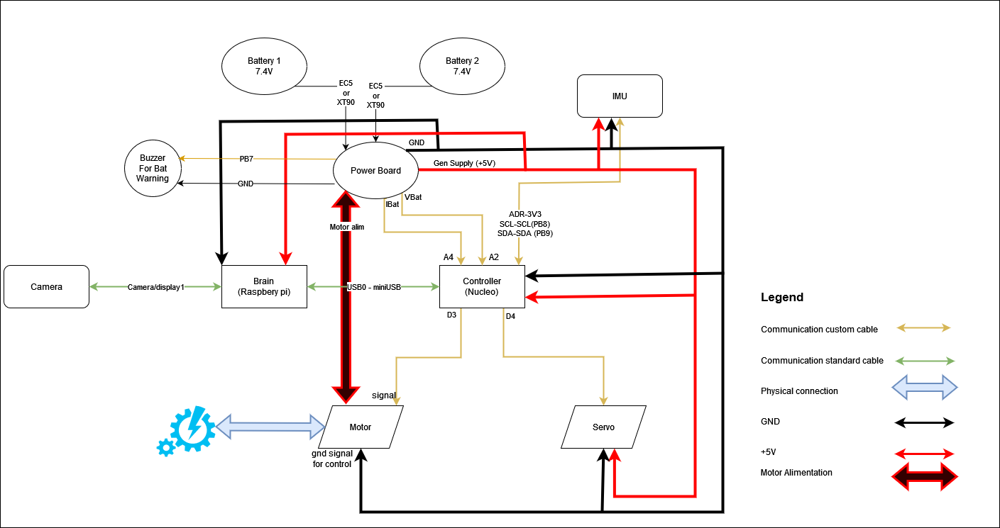

Connection diagram and components
==================================

.. toctree::
   :maxdepth: 1
   :hidden:

   hardwaresetupofcar/powerboard
   hardwaresetupofcar/hardwareimprovements
  
* :doc:`Powerboard <hardwaresetupofcar/powerboard>`

  - Info about the power distribution board.

* :doc:`Hardware improvements <hardwaresetupofcar/hardwareimprovements>`

  - The kit could use some mechanical improvements!

In this section, you can find all the topics related to the hardware of the vehicle. The vehicle, as stated in the regulation
and in the project description, is a 1/10 scale on-road vehicle, and it can come with various hardware fine tunned parts (as 
the vehicle is re-used), and is designed for hobby-ing usage. 

Here's the description of the car, with all it's commercial hardware components:

In this schematics you can see the connections diagram of all the HW components in the car. The GPIO lines are marked on each components.

And here's the table with all the components and all the needed details.
------------------------------------------------------------------------

Table1:

.. table::
   :width: 80%

   ================  ========================  =========  ================  ============  ======  =====================
   Product           Description               Quantity   Mount Materials   URL           Price   Picture
   ================  ========================  =========  ================  ============  ======  =====================
   Chassis           The base structure of     1          N/A               `Link 1`_     ~€74    .. image:: ../images/hardwaresetupforcar/products/Chassis.jpg
                     the car. Comes   

                     completely assembled. 
                     model: Reely TC-04 
   Servo             Actuator used for the     1          N/A               `Link 2`_     ~€22    .. image:: ../images/hardwaresetupforcar/products/Servo.jpg
                     steering mechanism. 
                     
                     model: RS-610WP 
                     (or similar) 
   Motor             Brushless motor with      1          N/A               `Link 3`_     ~€66    .. image:: ../images/hardwaresetupforcar/products/Motor.jpg
                     integrated ESC.   
                     
                     Controls the speed of 
                     the vehicle. 
                     
                     model: Quickrun Fusion  
                     SE, 1200KV 
   Brain             Single-board computer     1          2x m2x6           `Link 4`_     ~€80    .. image:: ../images/hardwaresetupforcar/products/Brain.jpg
                     thought to control the  
                     
                     automated part of the  
                     vehicle (thinking  
                     
                     part). model:                      
                     raspberry pi 4b 8GB RAM  
   Controller        Micro Controller used     1          2x m3x6           `Link 5`_     ~€32    .. image:: ../images/hardwaresetupforcar/products/Controller.jpg
                     to control the motors  
                     
                     and read data from the 
                     sensors and power  
                     
                     board. model: Nucleo  
                     F401RE         
   Camera            Monocular, wide-angle     1          2x m2x6 poly      `Link 6`_     ~€30    .. image:: ../images/hardwaresetupforcar/products/Camera.jpg
                     camera, the main sensor              +2x nuts
                     
                     in the vehicle. model: 
                     Raspbery pi  
                     
                     camera-module-3,  
                     wide-angle version 
   Battery           Used to power up the      1          N/A               `Link 71`_    ~€41    .. image:: ../images/hardwaresetupforcar/products/Battery.jpg
                     entire vehicle. It's a                                 
                     
                     2 cells LiPo battery,                                  `Link 72`_ 
                     ranging from 4500 mAh  
                     
                     to 6200 mAh (randomly                                  `Link 73`_
                     assigned) 
   IMU               Sensor Bosch BNO055       1          Ducktape          `Link 81`_    ~€25    .. image:: ../images/hardwaresetupforcar/products/IMU.jpg
                     installed on 3 kinds of                                
                     
                     different boards                                       `Link 82`_
                     (2 custom and 1  
                     
                     official). Randomly  
                     assigned to the teams. 
   Power board       Custom made power         1          3x 25 spacer-nut  `Link 9`_     N/A     .. image:: ../images/hardwaresetupforcar/products/Powerboard.jpg
                     distribution board.  
                     
                     Enables connection of 2 
                     batteries (increased  
                     
                     autonomy), delivers  
                     the power in the entire  
                     
                     vehicle, returns  
                     feedback regarding  
                     
                     battery voltage and the  
                     instant consumption of  
                     
                     the entire vehicle. 
                     It has also some  
                     
                     configurable aspects. 
   uSD Card          Micro SD card of 16GB.    1          N/A               `Link 10`_    ~€5     .. image:: ../images/hardwaresetupforcar/products/uSD.jpg
                     Serves as the  
                     
                     raspberry  
                     pi memory.Various  
                     
                     brands may be  
                     distributed. 
   USB0-miniUSB      Cable for communication   1          N/A               `Link 11`_    ~€3     .. image:: ../images/hardwaresetupforcar/products/USB0-miniUSB.jpg
                     between Raspberry and  
                     
                     Nucleo. USB(RPi) and  
                     mini-USB(Nucleo). It's  
                     
                     a 15cm cable. 
   Camera cable      Cable flexi cable for     1          N/A               `Link 12`_    ~€3     .. image:: ../images/hardwaresetupforcar/products/Cameracable.jpg
                     communication between  
                     
                     Raspberry and it's  
                     camera. It's a 30 cm  
                     
                     cable. 
   RPi alimentation  Cable for alimentation    1          N/A               `Link 13`_    ~€3     .. image:: ../images/hardwaresetupforcar/products/RPialimentation.jpg
                     of the raspbery pi.  
                     
                     It's a simple type-c  
                     cable 
   Charger           Charger for the LiPo      1          N/A               `Link 14`_    ~€32    .. image:: ../images/hardwaresetupforcar/products/Charger.jpg
                     battery.
   Car Body          The cover body that       1          N/A               `Link 151`_   ~€40    .. image:: ../images/hardwaresetupforcar/products/CarBody.jpg
                     goes on top of the car,                                 
                     
                     covering the entire                                    `Link 152`_
                     vehicle interior. 
                     
                     model: Lexus, BMW, ford                                `Link 153`_
                     assigned randomly. 
                     
                     The vehicle can be  
                     of various colors 
   ================  ========================  =========  ================  ============  ======  =====================

.. _Link 1: https://www.conrad.com/p/reely-tc-04-onroad-chassis-110-rc-model-car-electric-road-version-4wd-arr-1406735
.. _Link 2: https://www.conrad.com/p/reely-standard-servo-rs-610wp-mg-analogue-servo-gear-box-material-metal-connector-system-jr-2141322
.. _Link 3: https://www.hobbywingdirect.com/collections/quicrun-fusion-se
.. _Link 4: https://www.raspberrypi.com/products/raspberry-pi-4-model-b
.. _Link 5: https://www.conrad.com/p/stmicroelectronics-pcb-design-board-nucleo-f401re-stm32-f4-series-1416924
.. _Link 6: https://www.raspberrypi.com/products/camera-module-3/?variant=camera-module-3-wide
.. _Link 71: https://www.conrad.com/p/conrad-energy-scale-model-battery-pack-lipo-74-v-5500-mah-no-of-cells-2-20-c-softcase-xt90-1344152
.. _Link 72: https://www.conrad.com/p/hacker-scale-model-battery-pack-lipo-74-v-5000-mah-no-of-cells-2-20-c-softcase-xt90-2178297
.. _Link 73: https://www.conrad.com/p/absima-scale-model-battery-pack-lipo-74-v-6200-mah-60-c-hard-case-xt90-2357348
.. _Link 81: https://github.com/ECC-BFMC/Documentation/blob/master/source/PCB/imu_schematic.pdf
.. _Link 82: https://www.rutronik24.com/product/bosch+se/bno055+shuttle+board+3.0/16103955.html
.. _Link 9: https://bosch-future-mobility-challenge-documentation.readthedocs-hosted.com/data/connectiondiagram/powerboard.html
.. _Link 10: https://www.conrad.com/p/intenso-16-gb-micro-sdhc-card-microsdhc-card-16-gb-class-4-incl-sd-adapter-416887
.. _Link 11: https://www.conrad.com/p/renkforce-usb-cable-usb-20-usb-a-plug-usb-mini-b-plug-015-m-black-gold-plated-connectors-rf-4455804-1485268
.. _Link 12: https://www.conrad.com/p/joy-it-rb-camera-030-camera-cable-raspberry-pi-1x-csi-1x-csi-3000-cm-white-1426885
.. _Link 13: https://www.conrad.com/p/joy-it-k-1473-power-cable-raspberry-pi-arduino-banana-pi-cubieboard-1x-usb-c-plug-1x-open-cable-ends-100-m-blac-2159636
.. _Link 14: https://www.conrad.com/p/voltcraft-v-charge-eco-lipo-3000-scale-model-battery-charger-230-v-3-a-lipolymer-1409525
.. _Link 151: https://www.eurorc.com/product/21265/killerbody-lexus-rc-finished-body-orange-190mm
.. _Link 152: https://hpi-racing.ro/acasa/caroserie-vopsita-ford-mustang-mach-e-1400-200mm.html
.. _Link 153: https://hpi-racing.ro/onroadtouringdrift/caroserie-hpi-3d-bmw-m3-gt2-e92200mm.html

And here are the 3d printed components for the car itself. Available also in editable format, as sldprt extension at this link: `sldprt_extension`_.
----------------------------------------------------------------------------------------------------------------------------------------------------

.. _sldprt_extension: https://github.com/ECC-BFMC/Documentation/tree/master/source/3DModels/CustomParts/sldprt..

Table 2

================  ========================  =========  ================  ============  =====================
Product           Description               Quantity   Mount Materials   URL            Picture
================  ========================  =========  ================  ============  =====================
Boards support    The support for Raspbery  1          spacer nut + nut  `Link 21`_     .. image:: ../images/hardwaresetupforcar/products/Boardsupport.jpg
                  and Nucleo.                          threaded rod 
Camera support    The camera support        1          m2 x 20 + nut     `Link 22`_     .. image:: ../images/hardwaresetupforcar/products/Camerasupport.jpg
                  sitself. 
Camera rotation   The part that enables     1          2x spacer nut     `Link 23`_     .. image:: ../images/hardwaresetupforcar/products/Camerarotation.jpg
                  the rotation of the                  m3 + 2x nut + 
                  
                  camera.                              threaded rod
Chassis mount     The part that fixes the   1          2x M6x12 poly     `Link 24`_     .. image:: ../images/hardwaresetupforcar/products/Chassismount.jpg
                  entire assemble to the               + 2x nuts
                  
                  chassis.  
================  ========================  =========  ================  ============  =====================

.. _Link 21: https://github.com/ECC-BFMC/Documentation/blob/master/source/3DModels/CustomParts/Nucleo%2BRpi_Suport.STL..
.. _Link 22: https://github.com/ECC-BFMC/Documentation/blob/master/source/3DModels/CustomParts/PIcameraHolderPart2.STL..
.. _Link 23: https://github.com/ECC-BFMC/Documentation/blob/master/source/3DModels/CustomParts/PIcameraHolderPart3.STL..
.. _Link 24: https://github.com/ECC-BFMC/Documentation/blob/master/source/3DModels/CustomParts/PicameraHolderBase.STL..

There are some parts of the chassis available in STL in editable formats, created due to worn or lost here: `spare chassis`_.
---------------------------------------------------------------------------------------------------------------------------------

.. _spare chassis: https://github.com/ECC-BFMC/Documentation/tree/master/source/3DModels/CarSpareParts