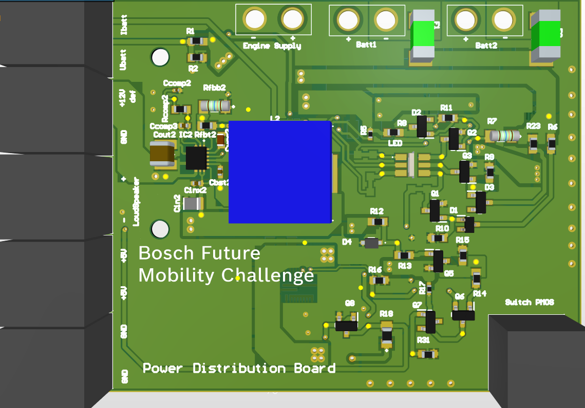

Power board
------------

On the robot we built a power distribution board which has the role of managing all the aspects of the power 
management inside the car.

For the protection of the batteries, the Powerboard has the following features:

    - To increase the cars autonomy, two batteries can be connected at any time (the board will work just fine with one). 
    - Though the board should handle a difference in charging levels of the batteries, please avoid plugging an empty and a full battery at the same time.
    - The Ibat pin returns a voltage value proportional to the instant consumption of the board (0V - 0mAh, 3.3V - 29.89Ah).
    - The Ubat pin returns a voltage value proportional to the total voltage of the battery/s level (0V - 0V, 3.3V - 8.9V).
    - For the current to flow through the board, the switch has to be enabled (Short). A led shows if the board is on.
    - If the current goes below 7V, the board will shut itself down. To safely replace the battery, switch off the board, change it, then switch it on.
    - The +12V def pin has a default current value of 12v, which can be adapted to return a value from 4.5v to +18V max (max 3A) with the following formula: Rrbt2 = ((Vtarget - 0.6)xRfbb2)/0.6; Where Rfbb2 must be below 300kΩ.
    - The +5V pins have a limit in current consumption of 15A.
    - The motor pins can drain the battery as much as the battery allows. 

All the data related to the powerboard can be found here:
`Power Distribution Board <https://github.com/ECC-BFMC/Documentation/blob/master/PCB/PWR_Board>`_
