Steering calibration
=====================

As part of our commitment to delivering exceptional experiences, each participant will receive a finely assembled RC car. Our dedicated assembly line has crafted these cars with precision, ensuring that they're ready for action right out of the box.

However, like all masterpieces, there might be minor variations in the steering calibration due to the manual assembly process. This isn't a flaw, but a testament to the individual attention each car has received. For instance, while you might set the car to turn at 15 degrees, it could turn at, say, 17 degrees in reality.

The Solution
------------
To enhance your experience and ensure consistent performance, we've developed a state-of-the-art software solution to address these minor calibration variations...

Measuring the Steering Angle
-----------------------------

To accurately measure the steering angle of the cars, it's essential to have the right tools on hand and to follow the steps below:

Required Tools:
----------------

1. Ruler: For precise measurements.
2. Two markers:
    a. One for the initial position of the car (when it's at 0).
    b. One for the final position of the car (when it reaches the desired point).

Measuring Procedure:
----------------------

1. Place the first marker underneath the midpoint of the rear axle when the car is at point 0.
2. Move the car to the desired point or its steering limit.
3. Place the second marker underneath the midpoint of the rear axle at the final position.
4. Ensure that the starting (0 point) and final positions are on the same straight line, essentially forming a semicircle.
5. Use the ruler to measure the distance between the two markers.
6. This distance will represent the diameter of the turning circle of the RC car. Use this value in the formula below.
   
   .. math:: \theta = \arctan\left(\frac{L}{R}\right)
   .. math:: \text{where:}
   .. math:: L = \text{wheelbase (260 mm = 0.26 m)}
   .. math:: R = \frac{\text{measured diameter}}{2} \text{[m]}

By following these steps, you'll obtain an accurate measurement of the car's steering angle. Ensure to perform these measurements in a stable environment without disturbances for the most accurate results.

Fine tune the steering system
--------------------------------

To fine-tune the steering calibration of your RC car, we focus on two main parameters:

**1. zero_default parameter**
   - In situations where the steering system exhibits significant deviations in a particular direction during testing, this parameter needs to be updated. For instance, if you test for values (15, -15) and obtain results (14, -16), adjustments are required.
**2. step_value parameter**
   - In situations where the steering system's response is either below or above the expected range during testing, this parameter should be adjusted. For instance, when testing for values (15, -15) and obtaining results such as (14, -14) or (16, -16), adjustments are required.

Adjusting the zero_default parameter
---------------------------------------

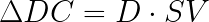

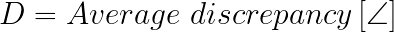

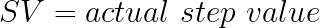

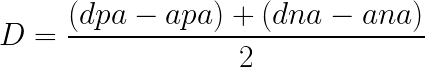

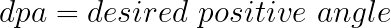

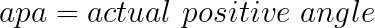

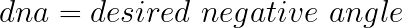

.. image:: ../../images/hardwaresetupforcar/steeringCalibration/deltaZeroDefault9.png
   :align: center
   :width: 50%

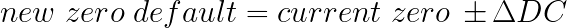

1. **Discrepancy (D)**:
   This represents the average difference between the desired and actual turning angles of the car.
   
   .. math:: D = \text{Average discrepancy}
   
2. **Step Value (SV)**:
   This value denotes the actual measure or increment by which the steering system operates.
   
   .. math:: SV = \text{actual step value}
   
3. **Adjustment to Calibration (ΔDC)**:
   This is the product of the discrepancy and the step value. It helps us determine how much we need to adjust our steering system to match our desired turning angle.
   
   .. math:: \Delta DC = D \times SV

Using the formulas above, you can calculate the `ΔDC` value, which will guide you on adjusting the `zero_default` value of the steering system. By doing this, you'll ensure that when you command your RC car to turn at a specific angle, it does so accurately!

Understanding Steering Angles
-----------------------------

When calibrating the steering system, it's essential to differentiate between the desired and actual steering angles, both in positive and negative directions:

1. **Actual Positive Angle (apa)**:
   The actual angle to which the RC car turns in a positive direction.
   
   .. math:: apa = \text{actual positive angle}
   
2. **Desired Negative Angle (dna)**:
   The angle you want the RC car to turn in a negative direction.
   
   .. math:: dna = \text{desired negative angle}
   
3. **Desired Positive Angle (dpa)**:
   The angle you want the RC car to turn in a positive direction.
   
   .. math:: dpa = \text{desired positive angle}
   
Now, to find the discrepancy (D) between the desired and actual angles, use:

.. math:: D = \frac{(dpa - apa) + (dna - ana)}{2}

This formula calculates the average difference between the desired and actual turning angles, in both positive and negative directions. This discrepancy will then be used in our earlier calculation for `ΔDC` to adjust the `zero_default` value accurately.

Remember, accurate steering calibration is crucial for optimal performance, so ensure you follow the above steps carefully.

Adjusting the Zero Default Value
--------------------------------

After determining the ΔDC value using the discrepancy (D) and the actual step value (SV), you can adjust the `zero_default` value of the steering system:

.. math:: \text{new zero default} = \text{current zero} \pm \Delta DC

Where:
- **new zero default** is the updated value to be set for the steering system.
- **current zero** is the present `zero_default` value of the steering system.
- **ΔDC** is the value we calculated earlier, which represents the adjustment needed.

This new zero default value will ensure that the RC car steers accurately according to the desired angle, taking into account any discrepancies found in the actual turning angles.

Understanding the Plus-Minus Sign
---------------------------------

When adjusting the `zero_default` value, it's important to understand the direction in which to make the adjustment:

- If the deviation is greater in the negative direction, you should increase the `zero_default` value. 
  For example, if you test the steering direction for the value set (15, -15) and you get results like (15.5, -16.5), then you should increase the `zero_default` value.

Conversely:

- If the deviation is greater in the positive direction, decrease the `zero_default`.

This will ensure that your RC car steers more accurately based on your desired settings.

2. Adjusting the Step Value
----------------------------

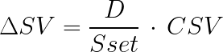

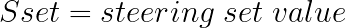

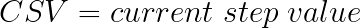

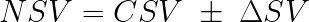

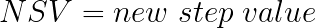

To fine-tune the steering mechanism's responsiveness, users can modify the step value. The formula for this is:

.. math::

   NSV = CSV \pm \Delta SV

Where:

- **NSV** : New Step Value
- **CSV** : Current Step Value
- **ΔSV** : Change in Step Value, which can be calculated as:

.. math::

   \Delta SV = \frac{D}{S_{set}} \times CSV

- **D** : Deviation (as calculated previously)
- **Sset** : Steering set value (the desired target for steering)

When to Adjust the Step Value
------------------------------

If the steering angle obtained is smaller than the desired one, then you need to increase the step value. 
For instance, if when testing the direction for a value of 15 you obtain 14, then you should increase the step value.

Utilize this guidance and the formulas provided to ensure that the steering mechanism is adjusted appropriately for optimal performance.