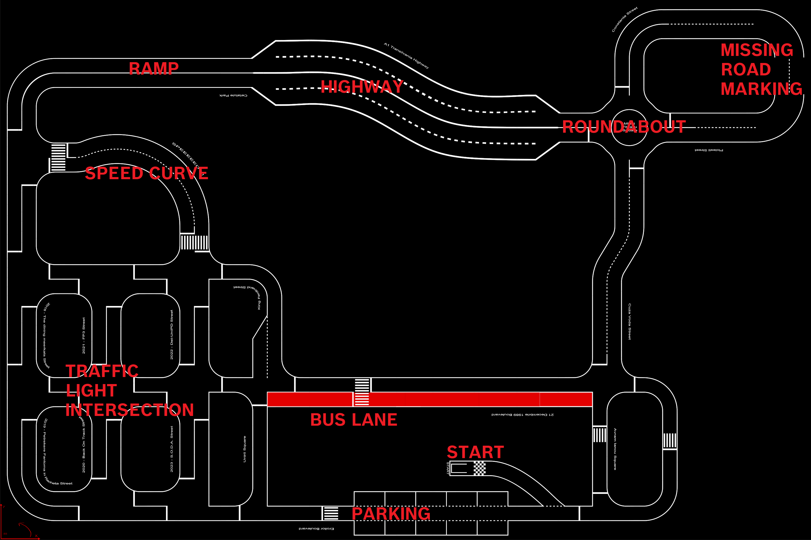

Race track
==========

.. toctree::
   :maxdepth: 1
   :hidden:

   racetrack/material
   racetrack/roadmarkings
   racetrack/trafficsigns
   racetrack/otherelements
   racetrack/localization

* :doc:`Material </data/racetrack/roadmarkings>`

  - Display of material characteristics
* :doc:`Road markings </data/racetrack/roadmarkings>`

  - The road markings on the track, their size and some other technical details. 

* :doc:`Traffic signs <racetrack/trafficsigns>`

  - The traffic signs PDF and the 3d model of the poles. 

* :doc:`Other elements on racetrack <racetrack/otherelements>`

  - Other elements on the track, like semaphores, pedestrian, blocks, etc.

* :doc:`Localization system replica <racetrack/localization>`

  - The description of our localization system, which you can use in order to create your own.

In this section the characteristics of the race track are described. You can find the maps in svg formats 
at the following links and extract all the non-specified dimensions: 

    - `Test-track <https://github.com/ECC-BFMC/Documentation/blob/master/source/racetrack/Track_Test.svg>`_  
    - `Race-track <https://github.com/ECC-BFMC/Documentation/blob/master/source/racetrack/Track.svg>`_   

**Elements positioning**

The corresponding elements are placed in those areas.
Start Semaphore at start. Parking sign at the beginind and at the end of the parking on left&right. Traffic lights at each entry of the intersection. Roundabout sign at the roundabout. Highway entry and exit. 

