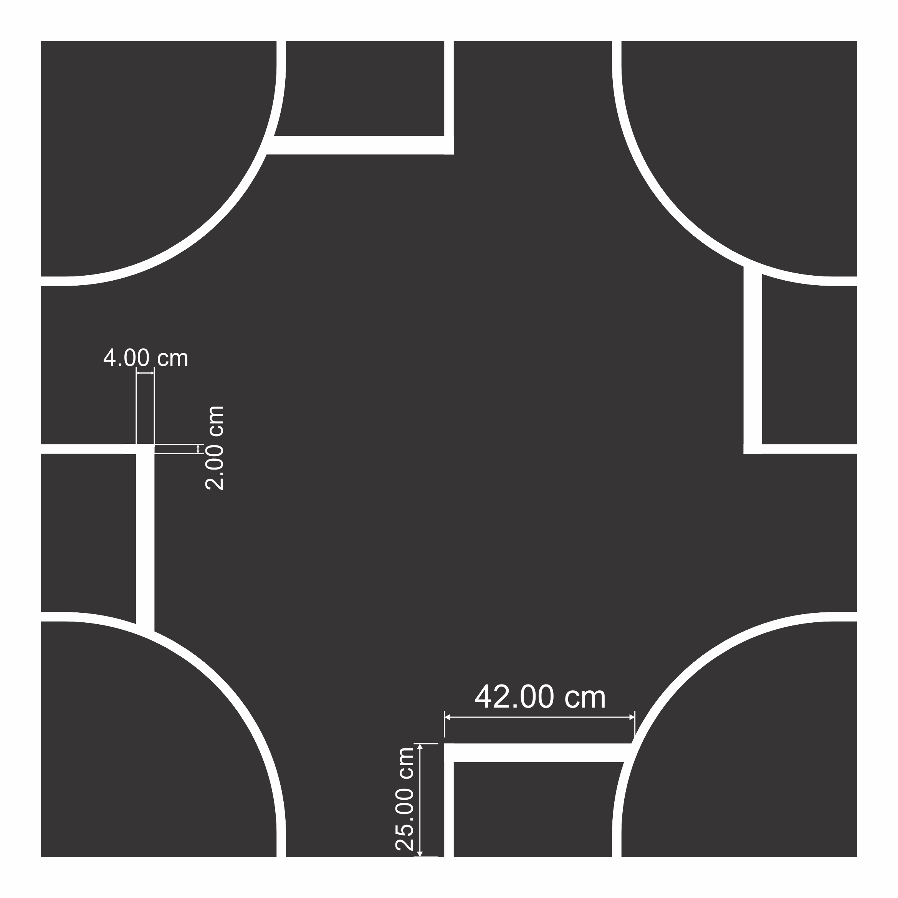
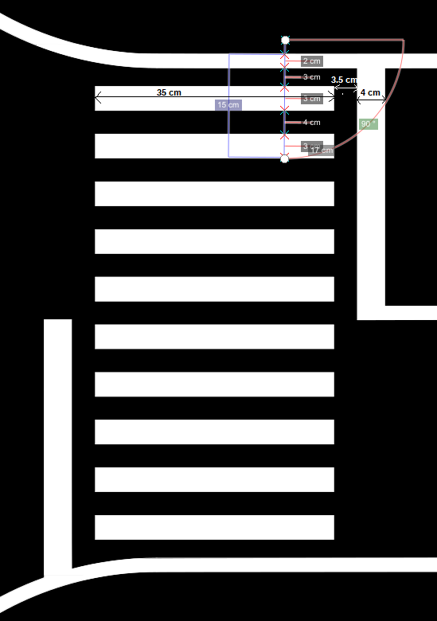

Race track
==========

.. toctree::
   :maxdepth: 1
   :hidden:

   racetrack/trafficsigns
   racetrack/otherelements
   racetrack/localization

* :doc:`Traffic signs <racetrack/trafficsigns>`

  - The traffic signs PDF and the 3d model of the poles. 

* :doc:`Other elements on racetrack <racetrack/otherelements>`

  - Other elements on the track, like semaphores, pedestrian, blocks, etc.

* :doc:`Localization system replica <racetrack/localization>`

  - The description of our localization system, which you can use in order to create your own.

In this section the characteristics of the race track are described. You can find the maps in svg formats 
at the following links and extract all the non-specified dimensions: 

    - `Test-track <https://github.com/ECC-BFMC/Documentation/blob/master/source/racetrack/Track_Test.svg>`_  
    - `Race-track <https://github.com/ECC-BFMC/Documentation/blob/master/source/racetrack/Track.svg>`_   

You can find below all road markings and their dimension. The lane markings may be dashed or continuous 
and are ~2cm wide white line. The lane has a width of ~35 cm, measured from the inside of the respective 
markings. In the case of dashed markings, the line has a length 4.5 cm and the distance between two marks 
is similarly 4.5 cm. 

.. image:: ../images/racetrack/road.png
   :align: center
   :width: 50%

As for the highway, the width of the lane is approximately 37 cm, where the lines are 4 cm in width
and the dotted line is of 9x9 cm (full and empty color).

The following image shows the tightest curve, which is the most common curve on the track. 

.. image:: ../images/racetrack/marking_tight_curve.png
   :align: center
   :width: 50%

Below you can see the two types of intersections:

.. image:: ../images/racetrack/intersection_T.png
   :align: center
   :width: 50%

Here are the dimensions for the crosswalk signalization

Here are the dimensions for the two types of parking spots

.. image:: ../images/racetrack/Parking_spots.PNG
   :align: center
   :width: 50%

And the dimensions for the roundabout

.. image:: ../images/racetrack/Roundabout.PNG
   :align: center
   :width: 50%

The locations of traffic sign and light are similar and are calculated with respect to the 
object (which can be an intersection, the end/beginning of the parking, or others). Each object 
is located ~10 cm before (or after, in depending on the case) the road signalization and ~5 cm 
outside the road limits.

.. image:: ../images/racetrack/Pedestrian_Sign_Position.png
   :align: center
   :width: 50%

**Starting point**
The starting point is made out of an incomplete rectangle, which is exactly the width of the vehicle (20cm)
and ends 56 cm from the chessboard print. 

The chessboard print is made out of a 7x6 squares matrix, occupying the entire width of the lane (5cm square).

The chessboard can be used for the automatic calibration of the camera.

