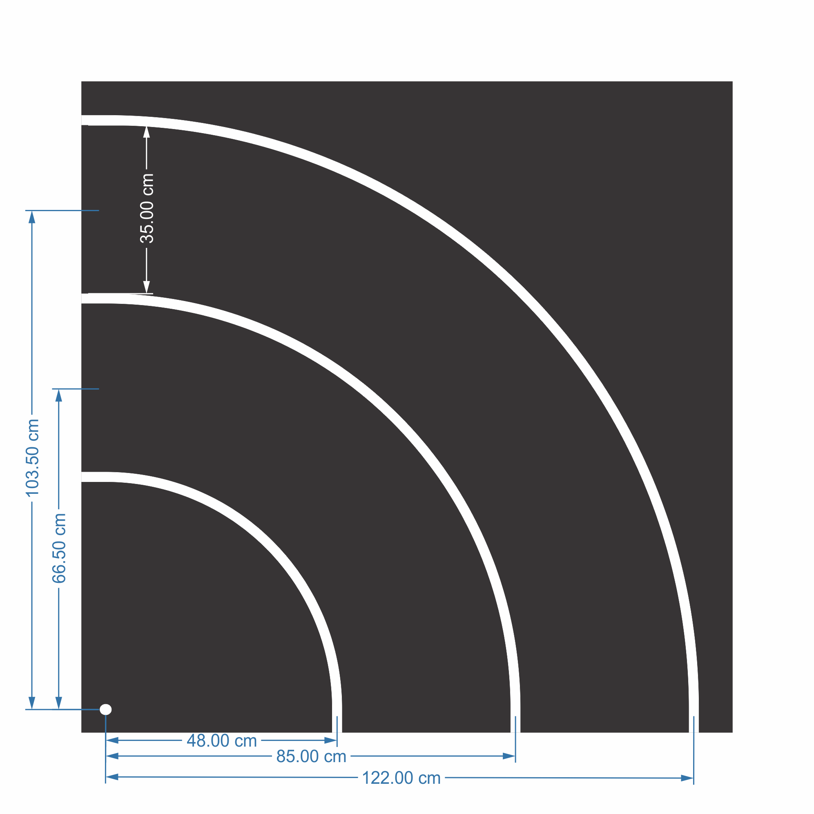

Ground markings
===============

Road markings
'''''''''''''

You can find below all road markings and their dimension. The lane markings may be dashed or continuous 
and are ~2cm wide white line. The lane has a width of ~35 cm, measured from the inside of the respective 
markings. In the case of dashed markings, the line has a length 4.5 cm and the distance between two marks 
is similarly 4.5 cm. 

The following image shows the tightest curve, which is the most common curve on the track. 

Below you can see the two types of intersections:

.. image:: ../../images/racetrack/intersection.png
   :align: center
   :width: 90%

.. image:: ../../images/racetrack/intersection_T.png
   :align: center
   :width: 90%

Here are the dimensions for the crosswalk signalization

.. image:: ../../images/racetrack/Crosswalk.PNG
   :align: center
   :width: 90%

Here are the dimensions for the two types of parking spots

.. image:: ../../images/racetrack/Parking_spots.PNG
   :align: center
   :width: 90%

And the dimensions for the roundabout

.. image:: ../../images/racetrack/Roundabout.PNG
   :align: center
   :width: 90%