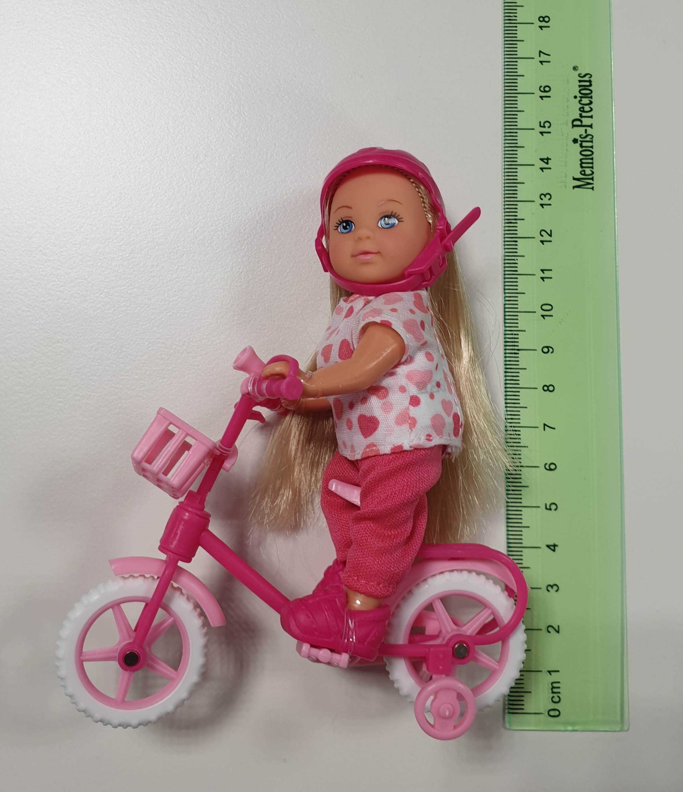
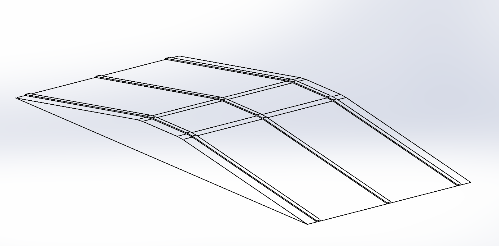

Other elements
==============

Traffic lights
--------------

The traffic lights are similar to the real traffic lights with three colors: red, yellow and green. 
It's 24 cm heigh and the lights are 4.5cm diameter. You can see on the pictures below:

There will be four semaphores on the race track. One placed at the track entrance, which will mark 
the start, and three placed in an intersection. Besides showing the appropriate color, they will 
also broadcast their state via Wi-Fi UDP messages (described in the V2X section). You can find the 
link to the traffic light here: `traffic light <https://www.amazon.com/TOYANDONA-Multicoloured-Simulation-Crosswalk-Education/dp/B08SM96CHK/ref=sr_1_5?keywords=traffic+light+toy&qid=1665752048&qu=eyJxc2MiOiI1LjQ3IiwicXNhIjoiNS4xNiIsInFzcCI6IjQuNjQifQ%3D%3D&sr=8-5>`_. 

Pedestrian
----------

On the race track there will be a human-like pedestrian doll waiting to pass at one of the crosswalks 
during the run and one crossing on an unsigned space on the map (if the team choses to have it)

Here you can find a picture of pedestrian:

You can find the official link to the store here: `pedestrian doll <https://www.amazon.co.uk/Simba-EVI-Love-First-Bike/dp/B000UTKNI0>`_. 

Obstacle vehicles
-----------------

The obstacle vehicles are robots with (possibly) different casing than the one of the participants. There 
are two types of vehicles: static and dynamic. A static vehicle is one which doesn't move and it can be 
placed either in a parking spot or on the road, simulating a broken car, while a dynamic vehicle is one 
which is moving on the track. The difference between them is that the dynamic vehicle streams it's position 
on the LAN

Highway separator
-----------------

A series of `Separator blocks <https://github.com/ECC-BFMC/Documentation/blob/master/source/3DModels/TrackParts/Separator_block.STL>`_
wil be placed on the highway, on the line which is dividing the driving ways. 

Ramp
----

A `ramp <https://github.com/ECC-BFMC/Documentation/blob/master/source/3DModels/TrackParts/ramp.STL>`_ placed right before the highway. 

The ramp is covered with the same material as the rest of the track, it's dimensions can be seen in the picture below:

Tunnel
------

A `tunnel <https://github.com/ECC-BFMC/Documentation/blob/master/source/3DModels/TrackParts/Tunnel.STL>`_ placed on the speed curve. 

