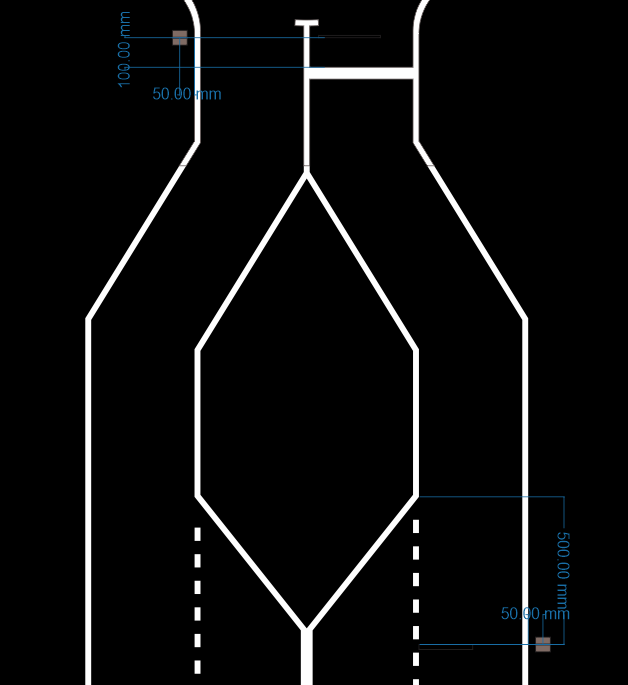

Positioning on track
====================

The locations of traffic sign and light are similar and are calculated with respect to the object 
(which can be an intersection, the end/beginning of the parking, or others). Each object is located ~10 cm before 
(or after, in depending on the case) the road signalization and ~5 cm outside the road limits.

.. image:: ../../images/racetrack/Pedestrian_Sign_Position.png
   :align: center
   :width: 90%

Exceptions to this rule are the highway traffic signs and:
    - Highway entry. There's a sign right at the intersection of the highway entrance
    - Highway exit. There's a sign before the dotted lane starts

