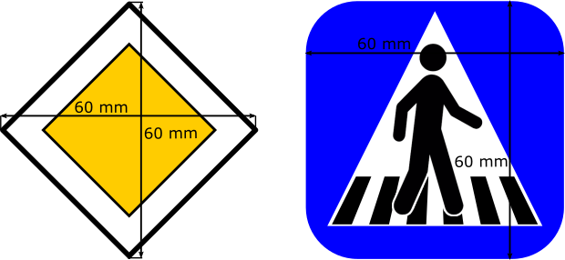
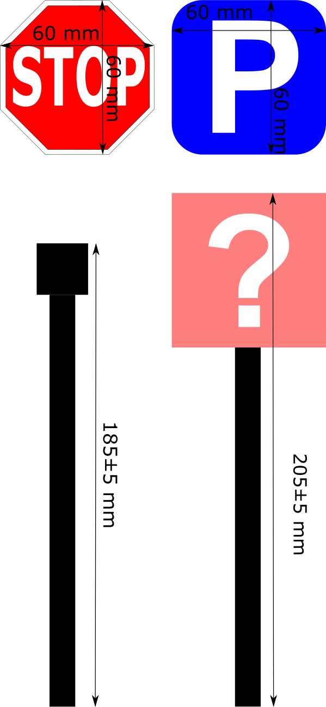
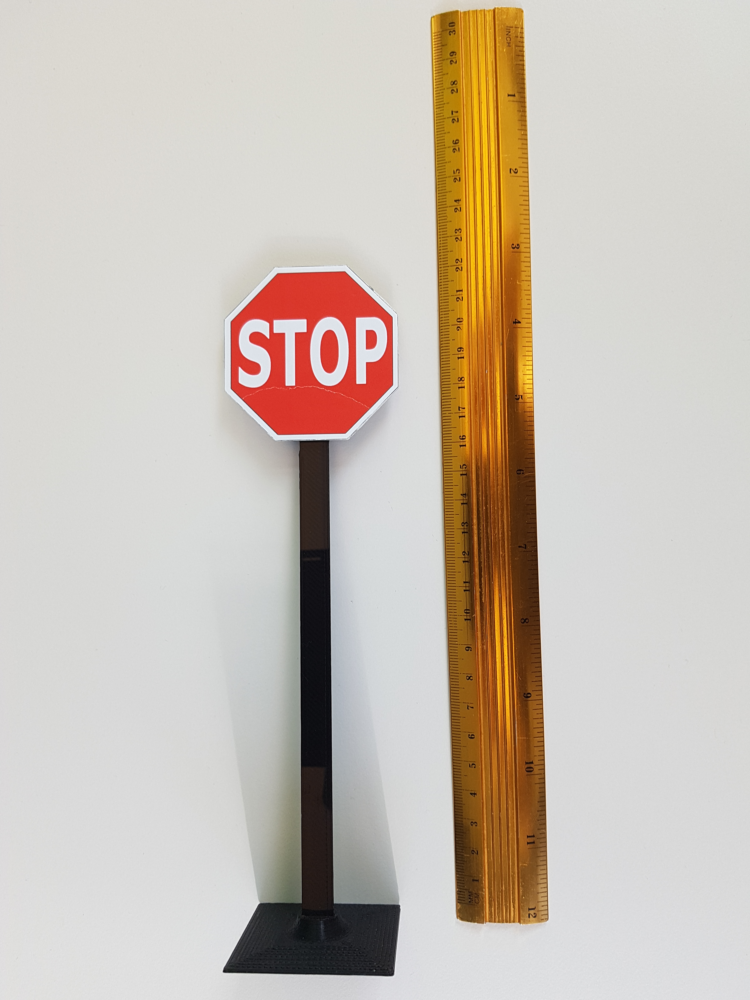

Traffic signs
=============

Signs
''''''

On the track can appear the following types of traffic signs:
 - Stop sign
 - Parking sign
 - Priority sign
 - Crosswalk sign
 - Highway entrance sign
 - Highway exit sign
 - Round-about sign
 - One way road sign
 - No-entry road sign
 
Here ou can find the `traffic signs <https://github.com/ECC-BFMC/Documentation/blob/master/source/templates/TrafficSign.pdf>`_  
in pdf format, which you can print in order to reproduce them.

Each sign is encapsulate in a 6x6 cm square (scaled accordingly. You can see two examples in the picture below:

The pillars of the traffic sign are ~18.5 cm and the sign is placed at in the middle of the pole positioning surface.
The complete heigh of the traffic sign is ~20cm. You can see an example below. A sample in STL format is given in the 
'3D printed components' section.

In the reality they look like on the pictures below:

Traffic sign stand (3D)
-----------------------
And here's the 3d models of the stands:
    - `Traffic sign base <https://github.com/ECC-BFMC/Documentation/blob/master/source/3DModels/sign_holder_base.STL>`_
    - `Traffic sign pole <https://github.com/ECC-BFMC/Documentation/blob/master/source/3DModels/sign_holder_pole.STL>`_