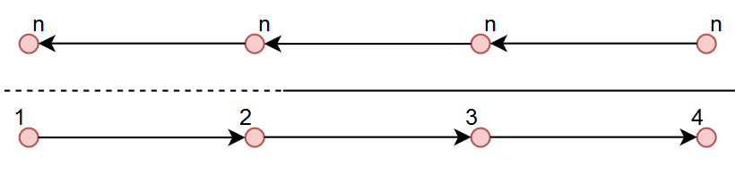

Localization system and mapping
================================
An indoor localization system is available. It aims to detect and send upon connection the relative position for each robot on the race track. The localization 
system is based on ROS2 in combination with a series of UWB devices. It has four main components: server, robot client(cars) and anchor device and tag device. 
The anchors are set into know positions on the track. The tag devices, communicate with the anchors in order to get their position on the map; then the tags connect 
to the server and sends in the location data. The server collects and stores the data from the tag devices (location on map) and waits for connections from the 
robot clients; then, upon connection, it serves the desired data to the clients. Down below a picture describing the process.

.. image::  ../../images/v2x/Localisation_system.png
  :align: center
  :scale: 60%

The system will be installed only at the phisical competition. It is made of two components: one fixed component that will be glued to the car body upon arrival 
and the actual device, which the team will get only while on the track. The active part will have displayed the ID of the connection. In the following image you 
can see the place where the device will be placed, the fixed component and the actual device.

.. image::  ../../images/v2x/Localisation_system_HW.png
  :align: center
  :scale: 60%

The device weights 280 grams and the mandatory position for the device is the one in the picture. The design can be found here:
  - `Bottom`_
  - `Box`_
  - `Top`
  
  .. _`Bottom`: https://github.com/ECC-BFMC/Documentation/blob/master/3DModels/Locsys_Bottom.STL
  .. _`Box`: https://github.com/ECC-BFMC/Documentation/blob/master/3DModels/Locsys_Box.STL
  .. _`Top`: https://github.com/ECC-BFMC/Documentation/blob/master/3DModels/Locsys_Tap.STL

Technical data of the system:
 - The frequency of the given messages is 5-10 Hz
 - The error of the system is of maximum 15 cm radius
 - The delay of the received messages is ~1 second

A digital map is provided in order to help the teams navigate in the environment. The map is saved in XML format and it is exported with the help of the GraphML 
library (making it easier to be imported on your platform). There are two types of information: Nodes and Connections. Each node is placed in the middle o a lane 
and the distance between 2 nodes(on the same lane) will be roughly ~30 cm, with some variations. A connection describes the relations between twp nodes (dotted 
or continuous line). Here you can see a straight road visual example:

Every node has 3 attributes: Id, X coordinate, Y coordinate. On the connectivity table instead, we have the start node id, the end node id and the type of 
connection (straight or dotted road: TRUE or FALSE). 

+------+-------+-------+--------+--------+----------+
| Nodes table          | Connections table          |
+======+=======+=======+========+========+==========+
|  id  |   X   |   Y   |  Id_1  |  Id_2  |  Dotted  |
+------+-------+-------+--------+--------+----------+
|   1  |  3.6  |  2.4  |   1    |   2    |   TRUE   |
+------+-------+-------+--------+--------+----------+
|   2  |  4.0  |  2.4  |   2    |   3    |   FALSE  |
+------+-------+-------+--------+--------+----------+
|   3  |  4.4  |  2.4  |   3    |   4    |   FALSE  |
+------+-------+-------+--------+--------+----------+
|   4  |  4.8  |  2.4  |                            |
+------+-------+-------+--------+--------+----------+

In the intersections case, there will be 3 points with the same coordinates for a 3 roads intersection(A1, A2, A3) and 4 points for a 4 roads intersection(A1, 
A2, A3, A4). This symbolization is done so to simulate a layered highway intersection, and so, helping you plan the path without taking into consideration U 
turn cases inside the intersection (if we only have a single point connected to all the nodes, then a turn like 18-A-17 would be possible). The representation 
is done in the following images.

+---------------------------------------------+---------------------------------------------+
| .. image:: ../../images/v2x/3roadsExample.PNG   | .. image:: ../../images/v2x/4roadsExample.PNG   |
+---------------------------------------------+---------------------------------------------+

You can find the figure and the digital representation on the following links: 
 - `Test track figure`_
 - `Test track digital`_
 - `Competition track figure`_
 - `Competition track digital`_

  .. _`Test track figure`: https://github.com/ECC-BFMC/Documentation/blob/master/source/images/Test_track.png
  .. _`Test track digital`: https://github.com/ECC-BFMC/Documentation/blob/master/source/templates/Test_track.graphml
  .. _`Competition track figure`: https://github.com/ECC-BFMC/Documentation/blob/master/source/images/Competition_track.png
  .. _`Competition track digital`: https://github.com/ECC-BFMC/Documentation/blob/master/source/templates/Competition_track.graphml

  The coordinates systems of the maps can be found here:
  - `Test track coordinate system`_
  - `Competition track coordinate system`_
  
     .. _`Test track coordinate system`: https://github.com/ECC-BFMC/Documentation/blob/master/source/templates/Track_Test.png
     .. _`Competition track coordinate system`: https://github.com/ECC-BFMC/Documentation/blob/master/source/templates/Track.png

To run
------
The API is listening for the server on the LAN. It validates the server and then connects to it with the car given ID. The server then returns the position of the 
car on the map. It uses the src/data/gpstracker/gpstracker.py. script to intercept all the data.

The simulated server can be found here: test/gpsstrackerSERVER/gps.py. 

- For testing purposes, publickey_server_test.pem should be used (file src/data/gpstracker/server_subscriber.py line 55)
- For the competition, publickey_server.pem should be used (file test/gpstracker/server_subscriber.py line 54)

Localisation system
--------------------

localisationsystem is a module designed to get the position and orientation of the car itself on the map from the Localization System server. 
The server streams it's TCP port on the broadcast port (12345). The client then tries to connect to the server on the communicated TCP port, by sending it's
own ID. The server replies with a plain and an encrypted message with it's own private key. The client decrypts the encrypted message with the server public
key and checks that the messages are the same. If the messages are the same, the server is validated by the client and the connection is initiated. 
The server then serves the client with it's position and orientation on the map. 

This simulates the real life GPS. 

The information can be used in order to validate the position on the track at each moment, making the car independent to a starting point. 

More details on the connection itself can be found in the src/data/localisationsystem/server_subscriber.py