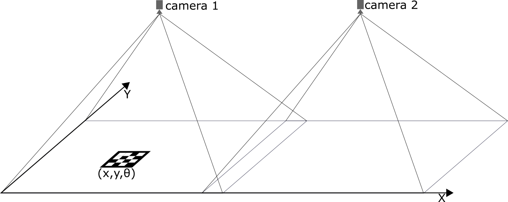

Localization system and Map
===========================

Localization system
````````````````````````
We made a indoor localization system, which aims to send the relative position for each robot on the 
race track. This system bases on a video camera network, where each unit is a Raspberry Pi. 
This approach uses ArUco markers to calibrate, determinate the position and orientation 
of robot. This localization system has three main components: server, robot client and camera client. 
The server collects the data from the camera client and it serves the robot clients with theirs coordination. 
THe image below shows the concept. 




In the case,  a team want to use this localization system, they need to satisfy following requirements:

 - A AruCo marker has to placed on the robot, which always can detected by the camera network. 
   This AruCo marker has 10x10 cm size and 1-2 cm wide white border. 
 - The robot client has to interact with our serves, so the robot must connect to our network. 
   An example client written in Python will be published soon in the start up project. 

Software:
  - GpsTracker is implemented in the Start-up project. You can find in the following `link`_. 
  - A simple version of GpsServer is realized in the test folder of Start-up project, which helps to test your application. 
  
  .. _`link`: https://bfmcstartup.readthedocs.io/en/stable/dataacquisition/GpsTracker.html

Map
`````````

The map is a description of the relationships between elements of some space. In our case, 
it has to provide information about the intersections and the streets. We use the map to 
represent the relationships between the streets in a digital format. The autonomous vehicles 
can find the possible paths from the start point to the goal by processing the digital map.

The map is represented by directed graph, which will exported in GraphML. 
