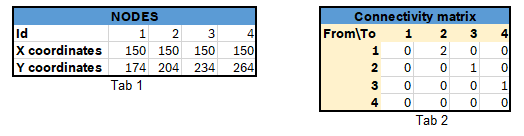

Localization system and Map
===========================

Localization system
````````````````````````
We made a indoor localization system, which aims to send the relative position for each robot on the 
race track. This system bases on a video camera network, where each unit is a Raspberry Pi. 
This approach uses ArUco markers to calibrate, determinate the position and orientation 
of robot. This localization system has three main components: server, robot client and camera client. 
The server collects the data from the camera client and it serves the robot clients with theirs coordination. 
THe image below shows the concept. 

.. image::  images/localizationSystem.png
   :align: center
   :scale: 50%


In the case,  a team want to use this localization system, they need to satisfy following requirements:

 - A AruCo marker has to placed on the robot, which always can detected by the camera network. 
   This AruCo marker has 10x10 cm size and 1-2 cm wide white border. 
 - The robot client has to interact with our serves, so the robot must connect to our network. 
   An example client written in Python will be published soon in the start up project. 

Software:
  - GpsTracker is implemented in the Start-up project. You can find in the following `link`_. 
  - A simple version of GpsServer is realized in the test folder of Start-up project, which helps to test your application. 
  
  .. _`link`: https://bfmcstartup.readthedocs.io/en/stable/dataacquisition/GpsTracker.html

Map
`````````

A digital map is a description of the elements amd their relationships in some space. In our case, 
it has to provide information about our miniature city so that your autonomous vehicles 
can find the possible paths from the start point to the goal by processing a small amount of data.

In our case the map will be saved in XML format,  
Each node is placed in the middle o a lane and the distance between 2 nodes(on the same lane) will be roughly around ~30 cm, with some variations.
All the data is exported by using the GraphML library, making it easier to be imported on your platform and eventually describe and 
Here we can see a straight road visual example:

.. image::  images/StraighRoadExample.PNG
  :align: center
  :scale: 60%

Every node has 3 attributes (Tab 1): Id, X coordinate, Y coordinate. On the connectivity table(Tab 2), instead, 
we have a matrix (NxN)  where no connection between the nodes is describer as 0, 
connection with straight line is describer as 1 and connection with dotted line(is described as 2).



As for the curves representation, the outside lane will be described with 5 nodes and the inside lane with 4. You can find a raw example in the next image.

.. image::  images/CurveExample.PNG
  :align: center
  :scale: 50%

In the intersections case, there will be 3 points with the same coordinates for a 3 roads intersection(A1, A2, A3) and 4 points for a 4 road intersection(A1, A2, A3, A4).
This symbolization is done so to simulate a layered highway intersection, and so helping you to plan the path without taking into consideration U turn cases inside the intersection
(if we only have a single point connected to all the nodes, then a turn like 18-A-14 would be possible). The representation is done in the following images.

+---------------------------------------+---------------------------------------+
| .. image:: images/3roadsExample.PNG   | .. image:: images/4roadsExample.PNG   |
+---------------------------------------+---------------------------------------+
  
  
You can find a figure with digital representation on the following links: `figure <https://github.com/ECC-BFMC/BFMC2020.Main/blob/master/source/images/EliminationMap.png>`_
and  `digital map <https://github.com/ECC-BFMC/BFMC2020.Main/blob/master/source/digitalmap/EliminationMap.graphml>`_ . 
