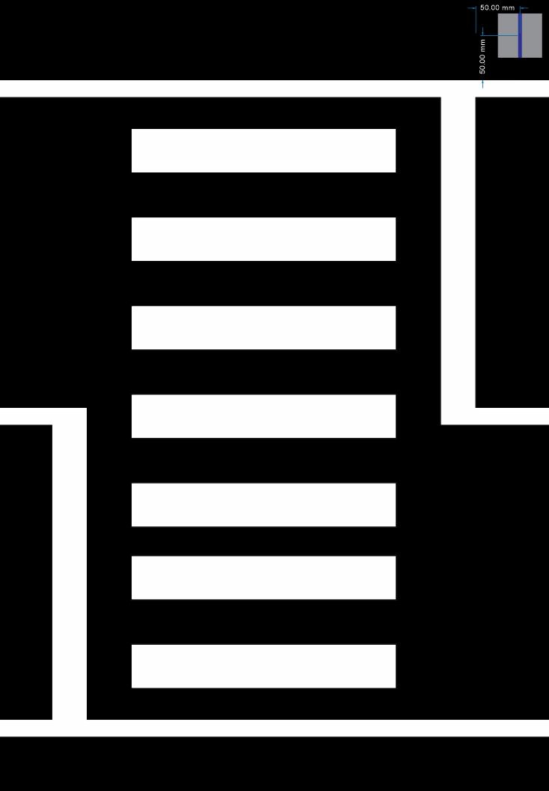

Race track
==========

On the race track will be placed traffic signs, other vehicles, pedestrians, traffic lights, ramp. 
In the next few sections are described more detailed the components. 

Road markings
'''''''''''''

You can find below all road markings and their dimension. The lane markings may be dashed or continuous and are ~2cm wide white line.
The lane has a width of ~35 cm, measured from the inside of the respective markings. 
In the case of dashed markings, the line has a length 4.5 cm and the distance between two marks is similarly 4.5 cm. 

.. image:: images/environment/road.png
   :align: center
   :scale: 30%

The following image shows the tightest curve, which is the most common curve on the track. 

.. image:: images/environment/marking_tight_curve.png
   :align: center
   :scale: 20%

Below you can see the two types of intersections:

.. image:: images/environment/intersection.png
   :align: center
   :scale: 20%

.. image:: images/environment/intersection_T.png
   :align: center
   :scale: 20%

Here are the dimensions for the crosswalk signalation

.. image:: images/environment/Crosswalk.PNG
   :align: center
   :scale: 80%

Here are the dimensions for the two types of parking spots

.. image:: images/environment/Parking_spots.PNG
   :align: center
   :scale: 80%

You can find the maps in svg formats. Here you can also see all the other dymensions: 
    - `Test track`_  
    - `Race track`_   
    
    .. _`Test track`: https://github.com/ECC-BFMC/BFMC_Main/blob/master/source/templates/Track_Test_1to2.svg
    .. _`Race track`: https://github.com/ECC-BFMC/BFMC_Main/blob/master/source/templates/Track_2021.svg

Traffic signs
'''''''''''''

On the track can appear four types of traffic sign:
 - Stop sign
 - Parking sign
 - Priority sign
 - Crosswalk sign
 - Highway entrance sign
 - Highway exit sign
 - Round-about sign
 - One way road sign
 - No-entry road sign
 
If you want to reproduce home the traffic signs with same size, than you need only to print the template file at the following link: `traffic signs`_ 
Each sign are encapsulate in a 6cm x 6cm square. You can see two examples in the picture below:

.. _`traffic signs`: https://github.com/ECC-BFMC/BFMC_Main/blob/master/source/templates/TrafficSign.pdf

.. image:: images/environment/TrafficSign_Example.png
   :align: center
   :scale: 75%

The pillars of the traffic sign are ~18.5 cm and the sign is placed at in the middle of the pole positioning surface.
The complete heigh of the traffic sign is ~20cm. You can see an example below.

.. image:: images/environment/TrafficSign_Construct.png
   :align: center
   :scale: 75%

In the reality they look like on the pictures below:

.. image:: images/environment/StopSignReal.jpg
   :align: center
   :scale: 10%

Traffic lights
''''''''''''''

The traffic lights are similar to the real lights with three color: red, yellow and green. 
It's 24 cm heigh and the lights are 4.5cm diameter. 
You can see on the pictures below:

.. image:: images/environment/TrafficLight.jpg
   :align: center
   :scale: 10%

There will be four semaphores on the race track. One placed at the track entrance, and three placed in an intersection. 
Besides showing the appropriate color, they will also broadcast their state via Wi-Fi UDP messages directed to a specific port.

Pedestrian
''''''''''

On the race track there will be a human-like pedestrian doll crossing one of the crosswalks during the run and one crossing on an unsignaled space 
on the map (if the team choses to have it)

The crosswalk pedestrian is located by the side o the road when the car arrives (right side). The car has to stop and after it stopped 
the pedestrian will completly cross the road. After the pedestrian crossed the car can continue it's movement on the round.

The unsignalled pedestrian will be located on the middle of the passing lane of the car. The car has to stop untill it leaves the road. 
The pedestrian can move either to the right or to the left.

Here you can find a picture of pedestrian:

.. image:: images/environment/Pedestriandoll.png
   :align: center
   :scale: 25%

You can find the templaofficial link to the store here: `pedestrian`_. 

.. _`pedestrian`: https://www.simbatoys.de/en/brands/evi-love/leisure/evi-love-my-first-bike-2-ass-105731715/

Obstacle vehicles
'''''''''''''''''

The obstacle vehicles are robots with different casing than the one of the participants. Videos of various runs, with various views of the cars 
are available at the links below. There are two types of vehicles: static and dynamic.
A static vehicle will be placed on one of each parking type, 
A static vehicle will be place on both lanes of a road. The lanes are separated by dashed lines. 
A dynamic vehicle will be placed on a highway and one on the one-way&one-lane road (on the country road). 

Only the dynamic vehicles will stream their position via Wi-Fi UDP messages directed to a specific port.

The obstacle vehicle is a fixed object on the right lane of road. 
On this part of the road the central line has to be dashed. The robot has to pass the line to left lane for avoiding 
the collision with the other vehicle and must return to right lane before the dashed line's ending. 

Closed road stand
'''''''''''''''''

The closed road stand is positioned on a one way&two lane road, it can be placed on each lane. If the stand is placed on the left lane, it's arrows are 
pointing to the right, that means that at the intersection the car has to go right. If it is placed on the right lane, it's arrows are pointing to the left, 
that means that at the intersection the car has to go to the left. This is the  `mark`_ , place on the separator identical to the highway separator. 
And here are two pictures of how it looks like:

.. _`mark`: https://github.com/ECC-BFMC/BFMC_Main/blob/master/source/templates/roadblock.pdf

.. image:: images/environment/roadblock_left.png
   :align: center
   :scale: 25%

.. image:: images/environment/roadblock_right.png
   :align: center
   :scale: 25%

Elements positioning on track
'''''''''''''''''''''''''''''

The locations of traffic sign and light are similar and are calculated with respect to the object center. Each object is located 10 cm before 
(or after, in depending on the case of the parking spot) the road signalation and 5 cm outside the road limits.

Exceptions to this rule are the highway traffic signs and:
    - Highway entry. There's a sign right at the intersection of the highway entrance
    - Highway exit. There's a sign before the dotted lane starts

.. image:: images/environment/Highway.PNG
   :align: center
   :scale: 60%

And at the following link, you can find some videos from the car perspective: `videos`_.

.. _`videos`: https://mega.nz/folder/7TAjVISZ#DwlfgB_xHLqvuiU6QjI3AA

Ramp
''''

The ramp is covered with the same material as the rest of the track, it's dimensions can be seen in the picture below:

.. image:: images/environment/ramp.png
   :align: center
   :scale: 100%
