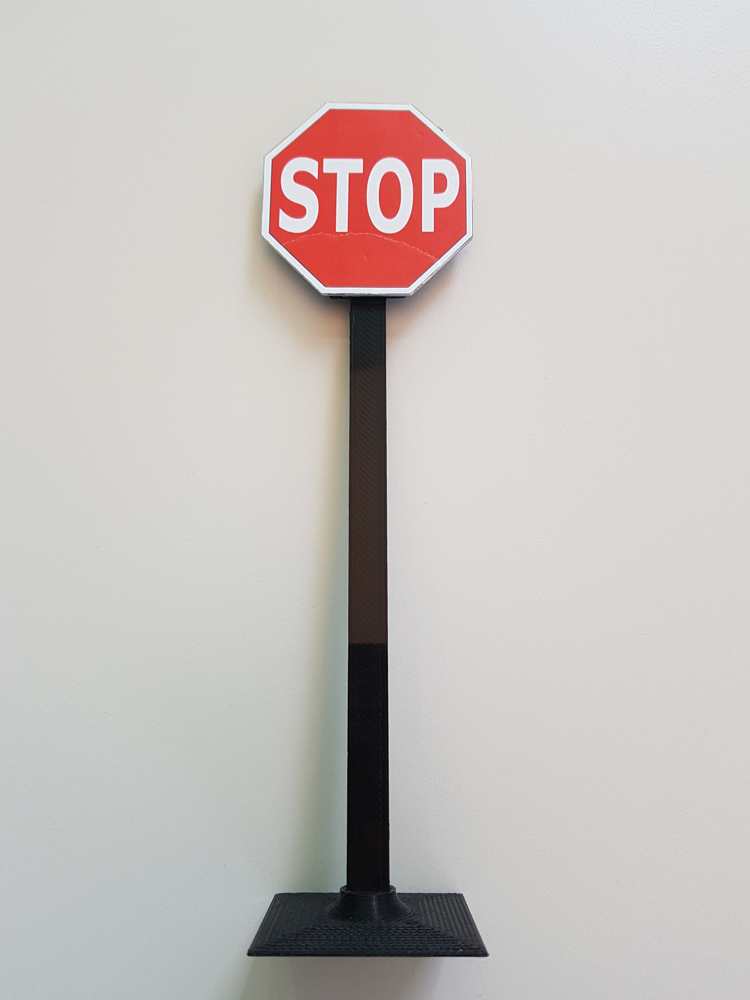
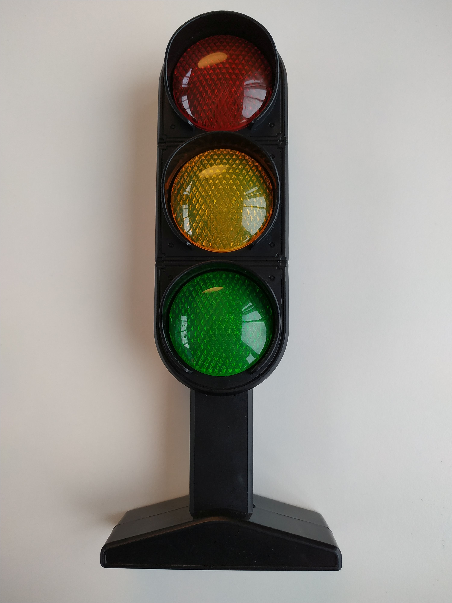

Traffic signs and lights
========================

Traffic signs
````````````````````````

On the track can appear four types of traffic sign:
 - Stop sign
 - Parking sign
 - Priority sign
 - Pedestrian crossing
If you want to reproduce home the traffic signs with same size, than you need only to print the template file. [`link <../../source/templates/TrafficSign2020.pdf>`_]
Each sign are 6cm heigh and 6cm width. You can see on the picture below:

.. image:: images/TrafficSign_Dim2.png
   :align: center
   :scale: 75%


Below you can find the heigh of the traffic sign, which has to be around 20cm. 
The pillars of the traffic sign are 18.5 cm heigh. 

.. image:: images/TrafficSign_Dim1.png
   :align: center
   :scale: 75%

In the reality they seems like on the pictures below:

.. image:: images/StopSignReal.jpg
   :align: center
   :scale: 10%




Traffic lights
````````````````````````

The traffic lights are similar to the real lights with three color: red, yellow and green. 
It's 24 cm heigh and the lights are 4.5cm diameter. 
You can see on the pictures below:



.. image:: images/TrafficLight_2.jpg
   :align: center
   :scale: 10%

There will be three semaphores on the track. One placed at the track entrance, and two placed in an intersection. 
Besides showing the appropriate color, they will also broadcast their state via Bluetooth advertisements (Manufacturer Specific Data field) 
and Wi-Fi UDP messages directed to a specific port. The messages consist of semaphore ID (0, 1, and 2) and state (red – 0/green – 1).

More information will be communicated later date. 